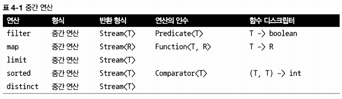
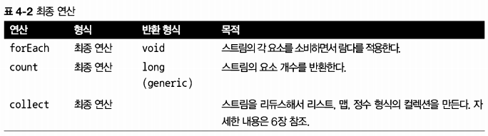

# [Chapter 04](https://livebook.manning.com/book/modern-java-in-action/chapter-4/)

## 스트림 소개

- 많은 요소를 포함하는 커다란 컬렉션은 어떻게 처리해야 할까?
    > 성능을 높이려면 멀티코어 아키텍처를 활용해서 병렬로 컬렉션의 요소를 처리해야 한다. 하지만 병렬 처리 코드 를 구현하는 것은 단순 반복 처리 코드에 비해 복잡하고 어렵다. 게다가 복잡한 코드는 디버깅도 어렵다.
    프로그래머가 귀중한 시간을 절약하고, 편리한 삶을 누릴 수 있도록 자바 언어 설계자들은 어떤 결정을 내렸을까?


### 4.1 스트림이란무엇인가?

- 자바 8 API에 새로 추가된 기능이다
- 선언형: 더 간결하고 가독성이 좋아진다.
  - 데이터를 처리하는 임시 구현 코드 대신 질의로 표현할 수 있다
  - 즉, 루프와 if 조건문 등의 제어 블록을 사용해서 어떻게 동작을 구현할지 지정할 필요 없이 '저칼로리의 요리만 선택하라' 같은 동작의 수행 을 지정할 수 있다. 3장에서 살펴본 것처럼 선언형 코드와 동작 파라미터화를 활용하면 변하는 요구사항에 쉽게 대응할 수 있다. 즉, 기존 코드를 복사하여 붙여 넣는 방식을 사용하지 않고 람다 표현식을 이용해서 저칼로리 대신 고칼로리의 요리만 필터링하는 코드도 쉽게 구현할 수 있다.
- 조립할수 있음: 유연성이 좋아진다. 
  - 파이프라인 형성
    - [그림4-1]에서처럼 filter, sorted, map, collect 같은 여러 빌딩 블록 연산을 연결해 서 복잡한 데이터 처리 파이프라인을 만들 수 있다. 여러 연산을 파이프라인으로 연결해도 여전히 가독성과 명확성이 유지된다. filter 메서드의 결과는 sorted 메서드로, 다시 sorted 결과는 map 메서드로, map 메서드의 결과는 collect로 연결된다.
    - 
    - filter (또는 sorted, map, collect) 같은 연산은 고수준 빌딩 블록(high-level building block)으로 이 루어져 있으므로 특정 스레딩 모델에 제한되지 않고 자유롭게 어떤 상황에서든 사용할 수 있다 (또한 이들은 내부적으로 단일 스레드 모델에 사용할 수 있지만 멀티코어 아키텍처를 최대한 투명하게 활용할 수 있게 구현되어 있다). 결과적으로 우리는 데이터 처리 과정을 병렬화하면 서 스레드와 락을 걱정할 필요가 없다. 이 모든 것이 스트림 API 덕분이다.
- 병렬화: 성능이좋아진다.
  - 멀티스레드 코드를 구현하지 않아도 데이터를 투명하게 병렬로 처리([Chapter07](./md/Chapter07.md))

### 4.2 스트림 시작하기

- 스트림의 인터페이스 정의는 java.util.stream.Stream 참고
- 스트림이란?
  - 데이터 처리 연산을 지원하도록 소스에서 추출된 연속된 요소(Sequence of elements)
  - 연속된 요소
    - 컬렉션과 마찬가지로 스트림은 특정 요소 형식으로 이루어진 연속된 값 집합의 인터페이스를 제공한다.
    - 컬렉션은 자료구조이므로 컬렉션에서는예를 들어 ArrayList 를 사용할것인지 아니면 Linked List 를 사용할것인지에 대한)시간과 공간의 복잡성과 관련된 요소 저장 및 접근 연산이 주를 이룬다.
    - 반면 스트림은 filter, sorted, map처럼 표현 계산식이 주를 이룬다.
    - 즉, 컬렉션의 주제는 데이터고 스트림의 주제는 계산이다.
  - 소스
    - 스트림은 컬렉션, 배열, I/O 자원 등의 데이터 제공 소스로부터 데이터를 소비한다.
    - 정렬된 컬렉션으로 스트림을 생성하면 정렬이 그대로 유지된다.
    - 즉, 리스트로 스트림 을 만들면 스트림의 요소는 리스트의 요소와 같은 순서를 유지한다.
  - 데이터 처리 연산
    - 스트림은 함수형 프로그래밍 언어에서 일반적으로 지원하는 연산과 데이터베이스와 비슷한 연산을 지원한다.
    - 예를 들어 filter, map, reduce, find, match, sort 등으로 데이터를 조작할 수 있다.
    - 스트림 연산은 순차적으로 또는 병렬로 실행할 수 있다.
  - 파이프라이닝(Pipelining)
    - 대부분의 스트림 연산은 스트림 연산끼리 연결해서 커다란 파이프 라인을 구성할 수 있도록 스트림 자신을 반환한다.
    - 그 덕분에 게으름(laziness), 쇼트서킷(short-circuiting) 같은 최적화도 얻을 수 있다([Chapter05](./md/Chapter07.md))
    - 연산 파이프라인은 데이터 소스에 적용하는 데이터베이스 질의와 비슷하다.
  - 내부 반복
    - 반복자를 이용해서 명시적으로 반복하는 컬렉션과 달리 스트림은 내부 반복을 지원한다. 4.3.2절에서 내부 반복을 자세히 설명한다.

- 

### 4.3 스트림과 컬렉션

- 자바의 기존 컬렉션과 새로운 스트림 모두 연속된 요소 형식의 값을 저장하는 자료구조의 인터 페이스를 제공한다.
- 여기서 '연속된(sequenced)'이라는 표현은 순서와 상관없이 아무 값에나 접속하는 것이 아니라 순차적으로 값에 접근한다는 것을 의미한다.
- 데이터를 언제 계산하느냐가 컬렉션과 스트림의 가장 큰 차이다.
- 컬렉션은 현재 자료구조가 포함하는 모든 값을 메모리에 저장하는 자료구조다.
  - 컬렉션의 모든 요소는 컬렉션에 추가하기 전에 계산되어야 한다(컬렉션에 요소를 추가하거나 컬렉션의 요소를 삭제할 수 있다. 이런 연산을 수행할 때마다 컬렉션의 모든 요소를 메모리에 저장해야 하며 컬렉션에 추가하려는 요소는 미리 계산되어야 한다).
  - 컬렉션은 적극적으로 생성된다(생산자 중심(supplier-driven) : 팔기도 전에 창고를 가득 채움). 
  - 소수 예제에 이를 적용해보자. 컬렉션은 끝이 없는 모든 소수를 포함하려 할 것이므로 무한 루프를 돌면서 새로운 소수를 계산하고 추가하기를 반복할 것이다.
- 스트림은 이론적으로 요청할 때만 요소를 계산하는 고정된 자료구조다.
  - 스트림에 요소를 추가하거나 스트림에서 요소를 제거할 수 없다. 
  - 이러한 스트림의 특성은 프로그래밍에 큰 도 움을 준다. 
  - 6장에서는 얼마나 간단하게 무제한의 소수(2, 3, 5, 7, 11, ...)를 포함하는 스트림 을 만들 수 있는지 설명한다.
  - 사용자가 요청하는 값만 스트림에서 추출한다는 것이 핵심이다.
  - 스트림은 생산자(Producer)와 소비자(Consumer) 관계를 형성한다. 또한 스트림은 게으르게 만들어지는 컬렉션과 같다.
    - 즉, 사용자가 데이터를 요청할 때만 값을 계산한다(경영학에서는 이를 요청 중심(demand-driven manufacturing) 또는 즉석 제조(just-in-time manufacturing) 라고부른다).
- 

#### 4.3.1 딱 한 번만 탐색할 수 있다

- 반복자와 마찬가지로 스트림도 한 번만 탐색할 수 있다. 즉, 탐색된 스트림의 요소는 소비된다.
- 반복자와 마찬가지로 한 번 탐색한 요소를 다시 탐색하려면 초기 데이터 소스에서 새로운 스트림을 만들어야 한다
  - 그러려면 컬렉션처럼 반복 사용할 수 있는 데이터 소스여야 한다. 만일 데이터 소스가 I/O 채널이라면 소스를 반복 사용할 수 없으므로 새로운 스트림을 만들 수 없다.
- 스트림과 컬렉션의 철학적 접근
  > `시간순으로 스트리밍탐색` 스트림을 시간적으로 흩어진 값의 집합으로 간주할 수 있다.
  > 
  > `공간내에서 컬렉션반복` 컬렉션은 특정 시간에 모든 것이 존재하는 공간(컴퓨터 메모리)에 흩어진 값으로 비유 할 수 있다. 우리는 for-each 루프 내에서 반복자를 이용해서 공간에 흩어진 요소에 접근할 수 있다.

#### 4.3.2 외부 반복과 내부 반복

- 외부 반복(external-iteration)
  - 컬렉션 인터페이스를 사용하려면 사용자가 직접 요소를 반복해야 한다(예를 들면 for-each 등을 사용해서).
  - ```
    마리오 : "소피아, 장난감 좀 정리하렴. 방바닥에 장난감이 있지?"
    소피아 : "네, 공이 있어요."
    마리오 : "좋아, 그럼 공을 상자에 담자. 또 어떤 장난감이 있지?"
    소피아 : "인형이 있어요."
    마리오 : "그럼 인형을 상자에 담자. 또 어떤 장난감이 있지?"
    소피아 : "책이 있어요."
    마리오 : "그럼 책을 상자에 담자. 또 어떤 장난감이 있지?"
    소피아 : "아무것도 없어요."
    마리오 : "참잘했어."
    ```
  - 병렬성을 스스로 관리해야 한다(병렬성을 스스로 관리한다는 것은 병렬성을 포기하든지 아니면 synchronized로 시작하는 힘들고 긴 전쟁을 시 작함을 의미한다)
- 내부 반복(internal-iteration)
  - 스트림 라이브러리는(반복을 알아서 처리하고 결과 스트림값을 어딘가에 저장해주는) 내부 반복을 사용한다.
  - 함수에 어떤 작업을 수행할지만 지정하면 모든 것이 알아서 처리된다. 
  - ```
    마리오 : '소피아, 바닥에 있는 모든 장난감을 상자에 담자'
    ```
    - 한 손에는 인형을 다른 한 손에는 공을 동시에 들 수 있다는 점
    - 먼저 모든 장난 감을 상자 가까이 이동시킨 다음에 장난감을 상자에 넣을 수 있다는 점
  - 작업을 투명하게 병렬로 처리하거나 더 최적화된 다양한 순서로 처리할 수 있다
  - 데이터 표현과 하드웨어를 활용한 병렬성 구현을 자동으로 선택
- 
  - 외부 반복
    - 반복문 내부에서 원소들을 다루는 작업이 불가능하다
  - 내부 반복
    - 반복문 내부에서 원소들을 다루는 작업이 가능하다
- 내부 반복은 반복을 추상화 한다
- 스트림은 내부 반복을 사용하므로 반복 과정을 우리가 신경 쓰지 않아도 된다.
- 하지만 이와 같은 이점을 누리려면 (filter나 map 같이) 반복을 숨겨주는 연산 리스트가 미리 정의되어 있어야 한다.
- 반복을 숨겨주는 대부분의 연산은 람다 표현식을 인수로 받으므로 3장에서 배운 동작 파라미터화를 활용할 수 있다. 

### 4.4 스트림 연산

- 

#### 4.4.1 중간 연산

- filter나 sorted 같은 중간 연산은 다른 스트림을 반환한다. 따라서 여러 중간 연산을 연결해서 질의를 만들 수 있다.
- 게으르다
  - 단말 연산을 스트림 파이프라인에 실행하기 전까지는 아무 연산도 수행하지 않는다는 것.
  - 중간 연산을 합친 다음에 합쳐진 중간 연산을 최종 연산으로 한 번에 처리하기 때문이다.
- 스트림의 게으른 특성 덕분에 몇 가지 최적화 효과를 얻을 수 있었다.
  - 첫째，300칼로리가 넘는 요리는 여러 개지만 오직 처음 3개만 선택되었다. 이는 limit 연산 그리고 쇼트서킷이라 불리 는 기법 덕분이다(5장에서 자세히 설명한다)
  - 둘째, filter와 map은 서로 다른 연산이지만 한 과정으로 병합되었다(이 기법을 루프 퓨전(loop fusion)이라고 한다).
- 중간 연산으로는 어떤 결과도 생성 할 수 없다.

#### 4.4.2 최종 연산

- 최종 연산은 스트림 파이프라인에서 결과를 도출한다.
  - 보통 최종 연산에 의해 List, Integer, void  등 스트림 이외의 결과가 반환된다.

#### 4.4.3 스트림 이용하기

- 스트림 이용 과정은 다음과 같이 세 가지로 요약할 수 있다.
  - 질의를 수행할 (컬렉션 같은) 데이터 소스
  - 스트림 파이프라인을 구성할 중간 연산 연결
  - 스트림 파이프라인을 실행하고 결과를 만들 최종 연산
> 스트림 파이프라인의 개념은 빌더 패턴(builder pattern)과 비슷하다. [참고](http://en.wikipedia.org/wiki/Builder_pattern)
> 
> 빌더 패턴에서는 호출을 연결해서 설정을 만든다(스트림에서 중간 연산을 연결하는 것과 같다). 그리고 준비된 설정에 build 메서드를 호출한다(스트림에서는 최종 연산에 해당함)

- 
- 