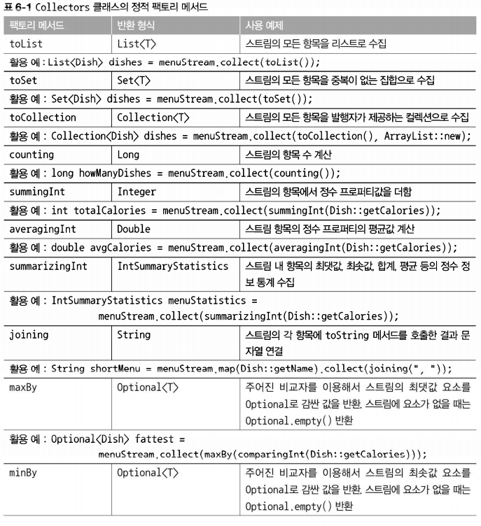
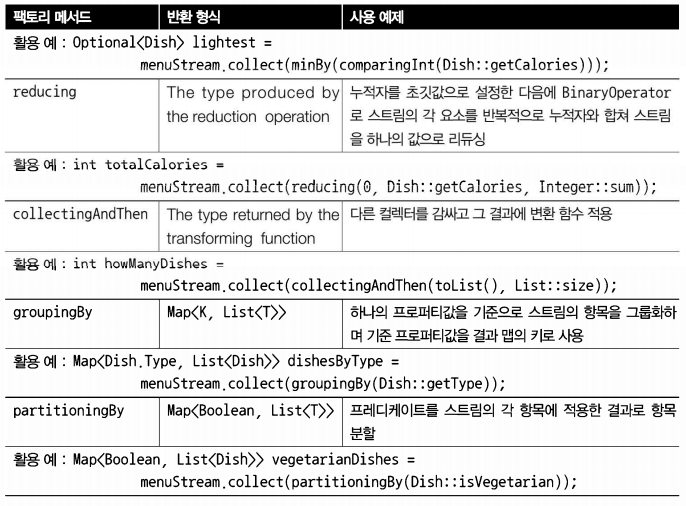

# [Chapter 06](https://livebook.manning.com/book/modern-java-in-action/chapter-6/)

## 스트림으로 데이터 수집

- toList로 스트림 요소를 항상 리스트로만 변환했다.
- 이 장에서는 reduce가 그랬던 것처럼 collect 역시 다양한 요소 누적 방식을 인수로 받아서 스트림을 최종 결과로 도출하는 리듀싱 연산을 수행할 수 있음을 설명한다.

- 컬렉션(Collections)，컬렉터(Collector), collect 구분
- 통화별로 트랜잭션을 그룹화한 다음에 해당 통화로 일어난 모든 트랜잭션 합계를 계산하시오(Map<Currency, Integer> 반환).
- 트랜잭션을 비싼 트랜잭션과 저렴한 트랜잭션 두 그룹으로 분류하시오(Map<Boolean, List <Transaction>> 반환).
- 트랜잭션을 도시 등 다수준으로 그룹화하시오. 그리고 각 트랜잭션이 비싼지 저렴한지 구분하시오 (Map<String, Map <Boolean, List <Transaction>>>) 반환).

### 6.1 컬렉터란무엇인가?

- 함수형 프로그래밍에서는 ‘무엇’을 원하는지 직접 명시할 수 있어서 어떤 방법으로 이를 얻을지는 신경 쓸 필요가 없다.
- toList
  - 각 요소를 리스트로 만들어라
- groupingBy
  - 각 키(통화) 버킷(bucket) 그리고 각 키 버킷에 대응하는 요소 리스트를 값으로 포함하는 맵(Map)을 만들어라


- 다수준(multilevel)으로 그룹화를 수행할 때 명령형 프로그래밍과 함수형 프로그래밍의 차이점이 더욱 두드러진다.
- 명령형 코드
  - 문제를 해결하는 과정에서 다중 루프와 조건문을 추가하며 가독성과 유지보수성이 크게 떨어진다. 
- 함수형 프로그래밍
  - 필요한 컬렉터를 쉽게 추가할 수 있다.

#### 6.1.1 고급 리듀싱 기능을 수행하는 컬렉터

- 높은 수준의 조합성과 재사용성
  - collect로 결과를 수집하는 과정을 간단하면서도 유연한 방식으로 정의할 수 있다는 점
  - 구체적으로 설명해서 스트림에 collect를 호출하면 스트림의 요소에(컬렉터로 파라미터화된) 리듀싱 연산이 수행된다.


  - 내부적으로 리듀싱 연산이 일어나는 모습
  - collect에서는 리듀싱 연산을 이용해서 스트림의 각 요소를 방문하면서 컬렉터가 작업을 처리한다.
  - 함수를 요소로 변환(toList처럼 데이터 자체를 변환하는 것보다는 데이터 저장 구조를 변환할 때가 많다)할 때는 컬렉터를 적용하며 최종 결과를 저장하는 자료구조에 값을 누적한다.
    - 변환 함수(`groupingBy`)는 각 트랜잭션에서 통화를 추출한 다음에 통화를 키로 사용해서 트랜잭션 자체를 결과 맵에 누적했다

#### 6.1.2 미리 정의된 컬렉터

- Collectors에서 제공하는 메서드의 기능은 크게 세 가지로 구분할 수 있다.
  1. 스트림 요소를 하나의 값으로 리듀스하고 요약 
  2. 요소그룹화 
  3. 요소분할

### 6.2 리듀싱과 요약

- 컬렉터 (Stream.collect 메서드의 인수)로 스트림의 항목을 컬렉션으로 재구성 할 수 있다. 
- 컬렉터로 스트림의 모든 항목을 하나의 결과로 합칠 수 있다.
  1. 트리를 구성하는 다수준 맵(6.3.1)
  2. 단순한 정수(6.2.2)

#### 6.2.1 스트림값에서 최댓값과 최솟값 검색

- `Collectors.maxBy`, `Collectors.minBy`
- 두 컬렉터는 스트림의 요소를 비교하는 데 사용할 `Comparator`를 인수로 받는다.

#### 6.2.2 요약연산

- `Collectors.summinglnt`, `Collectors.summingLong`, `Collectors.summingDouble`
- `summinglnt`는 객체를 `int`로 매핑하는 함수를 인수로 받는다.
- `summinglnt`의 인수로 전달된 함수는 객체를 `int`로 매핑한 컬렉터를 반환한다.
- 그리고 `summinglnt`가 `collect` 메서드로 전달되면 요약 작업을 수행한다.


- `averaginglnt`, `averagingLong`, `averagingDouble`
- 단순 합계 외에 평균값 계산 등의 연산도 요약 기능으로 제공된다.

- 종종 이들 중 두 개 이상의 연산을 한 번에 수행해야 할 때도 있다.
- 이런 상황에서는 팩토리 메서드 `summarizinglnt`, `summarizingLong`, `summarizingDouble` 가 반환하는 컬렉터를 사용할 수 있다.
- 메서드와 관련된 `IntSummaryStatistics`, `LongSummaryStatistics`, `DoubleSummaryStatistics` 클래스도 있다
- 예를 들어 다음은 하나의 요약 연산으로 메뉴에 있는 요소 수, 요리의 칼로리 합계，평균, 최댓값，최솟 값 등을 계산하는 코드다

#### 6.2.3 문자열 연결

- `joining` 팩토리 메서드를 이용하면 스트림의 각 객체에 toString 메서드를 호출해서 추출한 모든 문자열을 하나의 문자열로 연결해서 반환.
- 내부적으로 `StringBuilder`를 이용해서 문자열을 하나로 만든다.
- `Dish` 클래스가 요리명을 반환하는 `toString` 메서드를 포함하고 있다면 다음 코드에서 보여주는 것처럼 `map`으로 각 요리의 이름을 추출하는 과정을 생략할 수 있다.

#### 6.2.4 범용 리듀싱 요약 연산

- 지금까지 살펴본 모든 컬렉터는 `reducing` 팩토리 메서드로도 정의할 수 있다. 
- 즉, 범용 `Collectors.reducing`으로도 구현할 수 있다.
- 범용 팩토리 메서드 대신 특화된 컬렉터를 사용한 이유는 프로그래밍적 편의성 때문이다(하지만 프로그래머의 편의성 뿐만 아니라 가독성도 중요하다는 사실을 기억하자!)

```java
// 메뉴의 모든 칼로리 합계를 계산
        int totalCalories2 =
            menu.stream()
                .collect(reducing(0, Dish::getCalories, (i, j) -> i + j));
```
1. 첫 번째 인수는 리듀싱 연산의 시작값이거나 스트림에 인수가 없을 때는 반환값이다(숫자 합계에서는 인수가 없을 때 반환값으로 0이 적합하다). 
2. 두 번째 인수는 6.2.2절에서 요리를 칼로리 정수로 변환할 때 사용한 변환 함수다.
3. 세 번째 인수는 같은 종류의 두 항목을 하나의 값으로 더하는 `BinaryOperator`다. 예제에서는 두 개의 `int`가 사용되었다.
```java
// 가장 칼로리가 높은 요리를 찾는 방 법
        Optional<Dish> mostCalorieDish2 =
            menu.stream()
                .collect(reducing((d1, d2) -> d1.getCalories() > d2.getCalories() ? d1 : d2));
```
1. 첫 번째 인수, 스트림의 첫 번째 요소
2. 두 번째 인수, 자신을 그대로 반환하는 항등 함수(identity function)
- 한 개의 인수를 갖는 `reducing` 컬렉터는 시작값이 없으므로 빈 스트림이 넘겨졌을 때 시작값이 설정되지 않는 상황이 벌어진다.
- 한 개의 인수를 갖는 `reducing`은 `Optional<Dish>` 객체를 반환한다.

#### collect와 reduce

```java
Stream<Integer> stream = Arrays.asList(1, 2, 3, 4, 5, 6).stream();
        List<Integer> numbers = stream.reduce(
            new ArrayList<>(),
            (List<Integer> l, Integer e) -> {
                l.add(e);
                return l;
            },
            (List<Integer> l1, List<Integer> l2) -> {
                l1.addAll(l2);
                return l1;
            });
```
> toList 컬렉터를 사용하는 collect 대신 reduce 메서드를 사용할 수 있다.
> 위 코드에는 의미론적인 문제와 실용성 문제 등 두 가지 문제가 발생한다
> 
> 의미론적인 문제: collect 메서드는 도출하려는 결과를 누적하는 컨테이너를 바꾸도록 설계된 메서드인 반면 reduce는 두 값을 하나로 도출하는 불변형 연산이라는 점에서 의미론적인 문제가 일어난다.
> 
> 실용성 문제: 의미론적으로 reduce 메서드를 잘못 사용하면서 실용성 문제도 발생한다.
> 여러 스레드가 동시에 같은 데이터 구조체를 고치면 리스트 자체가 망가져버리므로 리듀싱 연산을 병렬로 수행할 수 없다는 점도 문제다.
> 이 문제를 해결하려면 매번 새로운 리스트를 할당해야 하고 따라서 객체를 할당하느라 성능이 저하될 것이다

#### 컬렉션 프레임워크 유연성 : 같은 연산도 다양한 방식으로 수행할 수 있다.


```java
public static <T> Collector<T, ?, Long> counting() {
            return reducing(0L, e -> 1L, Long::sum);
        }
```
- counting 컬렉터도 세 개의 인수를 갖는 reducing 팩토리 메서드를 이용 해서 구현할 수 있다.
- 즉，다음 코드처럼 스트림의 Long 객체 형식의 요소를 1로 변환한 다음에 모두 더할 수 있다.

#### 제네릭 와일드카드 '?' 사용법

> 위 예제에서 counting 팩토리 메서드가 반환하는 컬렉터 시그니처의 두 번째 제네릭 형식으로 와일드카드 '?'이 사용되었다.
> 자바 컬렉션 프레임워크(Java Collection Framework)를 자주 사용했던 독자라면 와일드카드 형식이 익숙할 것이다.
> 이 예제에서 '?'는 컬렉터의 누적자 형식이 알려지지 않았음을, 즉 누적자의 형식이 자유로움을 의미한다.
> 위 예제에서는 Collectors 클래스에서 원래 정의된 메서드 시그니처를 그대로 사용했을 뿐이다.
> 하지만 이후부터는 오해의 소지가 생기지 않도록 와일드카드 개념은 사용하지 않을 것이다.

#### 자신의 상황에 맞는 최적의 해법 선택

- 함수형 프로그래밍 (특히 자바 8의 컬렉션 프레임워크에 추가된 함수형 원칙에 기반한 새로운 API）에서는 하나의 연산을 다양한 방법으로 해결할 수 있음을 보여준다.
1. 스트림 인터페이스에서 직접 제공하는 메서드
2. 컬렉터를 이용
  - 코드가 더 복잡하다
  - 코드가 좀 더 복잡한 대신 재사용성과 커스터마이즈 가능성을 제공하는 높은 수준의 추상화와 일반화를 얻을 수 있다.

> 문제를 해결할 수 있는 다양한 해결 방법을 확인한 다음에 가장 일반적으로 문제에 특화된 해결책을 고르는 것이 바람직하다. 이렇게 해서 가독성과 성능이라는 두 마리 토끼를 잡을 수 있다. 

### 6.3 그룹화

- 명령형으로 그룹화를 구현하려면 까다롭고할, 일이 많으며, 에러도 많이 발생한다.
- 하지만 자바 8의 함수형을 이용하면 가독성 있는 한 줄의 코드로 그룹화를 구현할 수 있다. 
- `Collectors.groupingBy` 팩토리 메서드
- 분류 함수(classification function): 이 함수를 기준으로 스트림이 그룹화 된다


#### 6.3.1 그룹화된 요소 조작

- 각 결과 그룹의 요소를 조작하는 연산이 필요하다
- 그룹화를 하기 전에 프레디케이트로 필터를 적용 시
  - 우리의 필터 프레디케이트를 만족하는 FISH 종류 요리는 없으므로 결과 맵에서 해당 키 자체가 사라진다.
- Collectors 클래스는 일반적인 분류 함수에 Collector 형식의 두 번째 인수를 갖도록 groupingBy 팩토리 메서드를 오버로드해 이 문제를 해결한다.
  - Collector 안으로 필터 프레디케이트를 이동함으로 이 문제를 해결할 수 있다.
- 맵핑 함수를 이용해 요소를 변환하는 작업
  - filtering 컬렉터와 같은 이유로
  - Collectors 클래스는 매핑 함수와 각 항목에 적용한 함수를 모으는 데 사용하는 또 다른 컬렉터를 인수로 받는 mapping 메서드를 제공 한다.

#### 6.3.2 다수준 그룹화

- 두 가지 이상의 기준을 동시에 적용할 수 있을까?
- 효과적으로 조합할 수 있다는 것이 그룹화의 장점이다.
- `Collectors.groupingBy`
- 항목을 다수준으로 그룹화 할 수 있다.
  - 일반적인  분류  함수와  컬렉터를  인수로  받는다
  - 바깥쪽 groupingBy 메서드에 스트림의 항목을 분류할 두 번째 기준을 정의하는 내부 groupingBy 를 전달해서 두 수준으로 스트림의 항목을 그룹화할 수 있다.
  - 다수준 그룹화 연산은 다양한 수준으로 확장할 수 있다. 즉，n수준 그룹 화의 결과는 n수준 트리 구조로 표현되는 n수준 맵이 된다.


  - 보통 groupingBy의 연산을 '버킷(bucket) (물건을 담을 수 있는 양동이)' 개념으로 생각하면 쉽다.
  - 첫 번째 groupingBy는 각 키의 버킷을 만든다. 그리고 준비된 각각의 버킷을 서브스트림 컬렉 터로 채워가기를 반복하면서 n수준 그룹화를 달성한다.

#### 6.3.3 서브그룹으로 데이터 수집

- 첫 번째 groupingBy로 넘겨주는 컬렉터의 형식은 제한이 없다
- 분류 함수 한 개의 인수를 갖는 groupingBy(f)는 사실 groupingBy(f, toList())의 축약형이다.

#### 컬렉터 결과를 다른 형식에 적용하기

- 마지막 그룹화 연산에서 맵의 모든 값을 Optional로 감쌀 필요가 없으므로 Optional을 삭제할 수 있다.
- 즉，다음처럼 팩토리 메서드 `Collectors.collectingAndThen`으로 컬렉터가 반환한 결과를 다른 형식으로 활용할 수 있다.
- `collectingAndThen`은 적용할 컬렉터와 변환 함수를 인수로 받아 다른 컬렉터를 반환한다.
- 반환되는 컬렉터는 기존 컬렉터의 래퍼 역할을 하며 collect의 마지막 과정에서 변환 함수로 자신이 반환하는 값을 매핑한다.
- 이 예제에서는 `maxBy`로 만들어진 컬렉터가 감싸지는 컬렉터며, 변환 함수 `Optional::get`으로 반환된 `Optiona`l에 포함된 값을 추출한다.
- 이미 언급했듯이 리듀싱 컬렉터는 절대 `Optional.empty()`를 반환하지 않으므로(LAZY groupingBy 컬렉터는 스트림의 첫 번째 요소를 찾은 이후에야 그룹화 맵에 새로운 카를 (게으르게) 추가한다)
- 안전한 코드다. 다음은 맵의 결과다.


- 컬렉터는 점선으로 표시되어 있으며 `groupingBy`는 가장 바깥쪽에 위치하면서 요리의 종류에 따라 메뉴 스트림을 세 개의 서브스트림으로 그룹화한다. 
- `groupingBy` 컬렉터는 `collectingAndThen` 컬렉터를 감싼다. 따라서 두 번째 컬렉터는 그룹화된 세 개의 서브스트림에 적용된다.
- `collectingAndThen` 컬렉터는 세 번째 컬렉터 `maxBy`를 감싼다.
- 리듀싱 컬렉터가 서브스트림에 연산을 수행한 결과에 `collectingAndThen`의  `Optional::get` 변환함수가 적용된다. 
- `groupingBy` 컬렉터가 반환하는 맵의 분류 키에 대응하는 세 값이 각각의 요리 형식에서 가장 높은 칼로리다.

#### groupingBy와 함께 사용하는 다른 컬렉터 예제

- 일반적으로 스트림에서 같은 그룹으로 분류된 모든 요소에 리듀싱 작업을 수행할 때는 팩토리 메서드 `groupingBy`에 두 번째 인수로 전달한 컬렉터를 사용한다.
- 예를 들어 메뉴에 있는 모든 요리의 칼로리 합계를 구하려고 만든 컬렉터를 재사용할 수 있다.
```java
Map<Dish.Type, Integer> totalCaloriesByType =
            menu.stream().collect(groupingBy(Dish::getType,
                summingInt(Dish::getCalories)));
        
```
- 이 외에도 `mapping` 메서드로 만들어진 컬렉터도 `groupingBy`와 자주 사용된다
- 스트림의 인수를 변환하는 함수와, 변환 함수의 결과 객체를 누적하는 컬렉터를 인수로 받는다.

### 6.4 분할

- 분할은 분할함수(partitioning funtion)라 불리는 프레디케이트를 분류 함수로 사용하는 _특수한 그룹화_ 기능이다
- 분할 함수는 불리언을 반환하므로 맵의 키 형식은 `Boolean`이다.
- 결과적으로 그룹화 맵은 최대 (참 아니면 거짓의 값을 갖는) 두 개의 그룹으로 분류된다.
  - 더 간결하고 효과적

#### 6.4.1 분할의 장점

- 분할 함수가 반환하는 참，거짓 두 가지 요소의 스트림 리스트를 모두 유지

#### 6.4.2 숫자를 소수와 비소수로 분할하기




- 모든 컬렉터는 Collector 인터페이스를 구현

### 6.5 Collector 인터페이스

- Collector 인터페이스는 리듀싱 연산（즉，컬렉터）을 어떻게 구현할지 제공하는 메서드 집합으로 구성
- `toList`

```java
public interface Collector<T, A, R> {
    Supplier<A> supplier();
    BiConsumer<A, T> accumulator();
    Function<A, R> finisher();
    BinaryOperator<A> combiner();
    Set<Characteristics> characteristics();
}
```
- T는 수집될 스트림항목의 제네릭 형식이다.
- A는 누적자, 즉 수집 과정에서중간 결과를 누적하는 객체의 형식이다.
- R은 수집 연산 결과 객체의 형식 (항상 그런 것은 아니지만 대개 컬렉션 형식)이다.

```java
public class ToListCollector<T> implements Collector<T, List<T>, List<T>>
```
- Stream<T>의 모든  요소를
- List<T>로 수집

#### 6.5.1 Collector 인터페이스의 메서드 살펴보기

### `Supplier<A> supplier()`

- 새로운 결과 컨테이너 만들기
```java
public Supplier<List<T>> supplier() {
    return () -> new ArrayList<T>();
}
```
```java
public Supplier<List<T>> supplier() {
    return ArrayList::new;
}
```

### `BiConsumer<A, T> accumulator()`

- 결과 컨테이너에 요소 추가하기
```java
public BiConsumer<List<T>, T> accumulator(){
    return(list,item)->list.add(item);
}
```
```java
public BiConsumer<List<T>, T> accumulator() {
    return List::add;
}
```

### `Function<A, R> finisher()`

- 최종 변환값을 결과 컨테이너로 적용하기
```java
public Function<List<T>, List<T>> finisher() {
    return Function.identity();
}
```


### `BinaryOperator<A> combiner()`

- 두 결과 컨테이너 병합
```java
public BinaryOperator<List<T>> combiner() {
    return (list1, list2) -> {
        list1.addAll(list2);
        return list1; }
}
```


- 병렬화에서 사용
  - toList의 combiner는 비교적 쉽게 구현할 수 있다.
  - 스트림의 두 번째 서브 파트에서 수집한 항목 리스트를 첫 번째 서브파트 결과 리스트의 뒤에 추가하면 된다.
- 스트림을 분할해야 하는지 정의하는 조건이 거짓으로 바뀌기 전까지 원래 스트림을 재귀적으로 분할한다
  - 보통 분산된 작업의 크기가 너무 작아지면 병렬 수행의 속도는 순차 수 행의 속도보다 느려진다. 즉, 병렬 수행의 효과가 상쇄된다.
  - 일반적으로 프로세싱 코어 의 개수를 초과하는 병렬 작업은 효율적이지 않다 
- 이제 ［그림 6-7]에서 보여주는 것처럼 모든 서브스트람의 각 요소에 리듀싱 연산을 순차적으로 적용해서 서브스트림을 병렬로 처리할 수 있다.
- 마지막에는 컬렉터의 combiner 메서드가 반환하는 함수로 모든 부분결과를 쌍으로 합친다.
  - 즉，분할된 모든 서브스트림의 결과를 합치면서 연산이 완료된다.

### `Set<Characteristics> characteristics()`

- 컬렉터의 연산을 정의하는 `Characteristics` 형식의 불변 집합을 반환한다.
- 스트림을 병렬로 리듀스할 것인지 그리고 병렬로 리듀스한다면 어떤 최적화를 선택해야 할지 힌트를 제공한다.
- `Characteristics`는 다음 세 항목을 포함하는 열거형이다.
- 컬렉터가 수행하는 작업의 속성에 대한 정보를 제공하기 위한 것 아래 세가지 속성 중 해당하는 것을 Set에 담아서 반환하도록 구현하면 됨
```java
public Set<Characteristics> charateristics() {
    return Collections.unmodifiableSet(EnumSet.of(
                 Collector.Characteristics.CONCURRENT,
                 Collector.Characteristics.UNORDERED
           ));
}
```
- 아무런 속성도 지정하고 싶지 않은 경우
```java
public Set<Characteristics> characteristics() {
    return Collections.emptySet();  // 지정할 특성이 없는 경우 비어있는 Set 반환
}
```

1. UNORDERED
   - 리듀싱 결과는 스트림 요소의 방문 순서나 누적 순서에 영향을 받지 않는다.
2. CONCURRENT
   - 다중 스레드에서 accumulator 함수를 동시에 호출할 수 있으며 이 컬렉터는 스트림의 병렬 리듀싱을 수행할 수 있다.
   - 컬렉터의 플래그에 UNORDERED를 함께 설정 하지 않았다면 데이터 소스가 정렬되어 있지 않은（즉，집합처럼 요소의 순서가 무의미 한）상황에서만 병렬 리듀싱을 수행할 수 있다. 
3. IDENTITY_FINISH
   - finisher 메서드가 반환하는 함수는 단순히 identity를 적용할 뿐 이므로 이를 생략할 수 있다.
   - 따라서 리듀싱 과정의 최종 결과로 누적자 객체를 바로 사용할 수 있다. 
   - 또한 누적자 A를 결과 R로 안전하게 형변환할 수 있다.

- ToListCollector
  - IDENTITY_FINISH
    - ToListCollector에서 스트림의 요소를 누적하는 데 사용한 리스트가 최종 결과 형식이므로 추가 변환이 필요 없다.
  - UNORDERED
    - 리스트의 순서는 상관이 없다
  - CONCURRENT
    - 요소의 순서가 무의미
```java
public Set<Characteristics> charateristics() {
    return Collections.unmodifiableSet(EnumSet.of(
                 Collector.Characteristics.IDENTITY_FINISH,
                 Collector.Characteristics.CONCURRENT,
                 Collector.Characteristics.UNORDERED
           ));
}
``` 

#### 6.5.2 응용하기

### 6.6 커스텀 컬렉터를 구현해서 성능 개선하기

#### 6.6.1 소수로만 나누기

## 마치며

- collect는 스트림의 요소를 요약 결과로 누적하는 다양한 방법 （컬렉터라 불리는）을 인수로 갖는 최종 연산이다.
- 스트림의 요소를 하나의 값으로 리듀스하고 요약하는 컬렉터뿐 아니라 최솟값，최댓값，평균값을 계산하는 컬렉터 등이 미리 정의되어 있다.
- 미리 정의된 컬렉터인 groupingBy로 스트림의 요소를 그룹화하거나，partitioningBy로 스트림의 요소를 분할할 수 있다.
- 컬렉터는 다수준의 그룹화, 분할，리듀싱 연산에 적합하게 설계되어 있다.
- Collector 인터페이스에 정의된 메서드를 구현해서 커스텀 컬렉터를 개발할 수 있다.