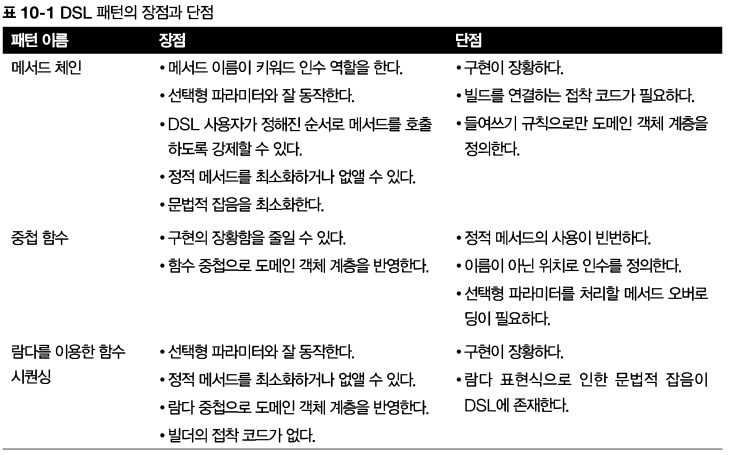

# [Chapter 10](https://livebook.manning.com/book/modern-java-in-action/chapter-10/)

# 람다를 이용한 도메인 전용 언어

## 이 장의 내용
- 도메인 전용 언어(domain-specific languages, DSL)란 무엇이며 어떤 형식으로 구성되는가?
- DSL을 API 에 추가할 때의 장단점
- JVM에서 활용할 수 있는 자바 기반 DSL을 깔끔하게 만드는 대안
- 최신 자바 인터페이스와 클래스에 적용된 DSL에서 배움
- 효과적인 자바 기반 DSL을 구현하는 패턴과 기법
- 이들 패턴을 자바 라이브러리와 도구에서 얼마나 흔히 사용하는가?

- 프로그래밍 언어도 결국 언어
- 메시지를 명확하고, 안정적인 방식으로 전달하는 것
- 개발팀과 도메인 전문가가 공유하고 이해할 수 있는 코드는 생산성과 직결
  - 도메인 전문가는 소프트웨어 개발 프로세스에 참여할 수 있고 비즈니스 관점에서 소프트웨어가 제대로 되었는지 확인할 수 있다. 결과적으로 버그와 오해를 미리 방지할 수 있다.
  - 도메인 전용 언어(DSL)로 애플리케이션의 비즈니스 로직을 표현

- DSL은 작은, 범용이 아니라 특정 도메인을 대상으로 만들어진 특수 프로그래밍 언어
- DSL은 도메인의 많은 특성 용어를 사용


- DLS 예시 (출처: https://unabated.tistory.com/entry/DSLDomain-Specific-Language-이해하기 [랄라라])
  - java
    - ANT, Maven, struts-config.xml, Seasar2 S2DAO, HQL(Hibernate Query Language), JMock
  - Ruby
    - Rails Validations, Rails ActiveRecord, Rake, RSpec, Capistrano, Cucumber
  - 기타
    - SQL, CSS, Regular Expression(정규식), Make, graphviz


- ```java
  while (block != null) {
      read(block, buffer)
          for (every record in buffer) {
              if (record.calorie < 400) {
                  System.out.println (record.name);
              }
          }
      block = buffer.next();
  }
  ```
  - 문제점: 애플리케이션 수준이 아니라 시스템 수준의 개념을 다루고 있음.
- ```java
  menu.stream()
     .filter(d -> d.getCalories() < 400)
     .map(Dish::getName)
     .forEach(System.out::println)
  ```
  - 스트림 API : 보통 자바의 루프의 복잡합 제어와 비교해 유창한 플루언트 스타일(fluent style)


- 기본적으로 DSL을 만들려면 애플리케이션 수준 프로그래머에 어떤 동작이 필요하며 이들을 어떻게 프로그래머에게 제공하는지 고민이 필요하다(동시에 시스템 수준의 개념으로 인해 불필요한 오염이 발생하지 않도록 해야함). 
- 내부적 DSL : 내부적(internal) DSL에서는 위에서 언급한 SQL의 SELECT FROM 구문처럼 애플리케이션 수준의 기본값이 자바 메서드가 사용할 수 있도록 데이터베이스를 대표하는 한 개 이상의 클래스 형식으로 노출된다
- 외부적 DSL : DSL 문법 뿐 아니라 DSL을 평가하는 파서도 구현해야 한다. 하지만 이를 제대로 설계한다면 숙련도가 떨어지는 프로그래머 일지라도 아름답지만 비전문가가 이해하긴 어려운 기존 시스템 수준 코드 환경에서 새 코드를 빠르고 효과적으로 구현할 수 있다.

## 10.1 도메인 전용 언어

- DSL은 특정 비즈니스 도메인의 문제를 해결하려고 만든 언어
- DSL이란 특정 비즈니스 도메인을 **인터페이스**로 만든 API
- DSL은 범용 프로그래밍 언어가 아니다.
- 동작과 용어는 특정 도메인에 국한되므로 다른 문제는 걱정할 필요가 없고 오직 자신의 앞에 놓인 문제를 어떻게 해결할지에만 집중할 수 있다.
  - 관심사의 분리, 구현과 활용의 분리
- 사용자가 특정 도메인의 복잡성을 더 잘 다룰 수 있다
  - 저수준 구현 세부 사항 메서드는 클래스의 비공개로 만들어서 저수준 구현 세부 내용은 숨길 수 있다.
  - 사용자 친화적인 DSL을 만들 수 있다.

- DSL의 역할
  - 의사소통
    - 우리의 코드의 의도가 명확히 전달되어야 하며 프로그래머가 아닌 사람도 이해할 수 있어야 한다. 이런 방식으로 코드가 비즈니스 요구사항에 부합하는지 확인할 수 있다.
  - 가독성
    - 한 번 코드를 구현하지만 여러 번 읽는다, 가독성은 유지 보수의 핵심이다. 즉, 항상 우리의 동료가 쉽게 이해할 수 있도록 코드를 구현해야 한다.

  - DSL은 평문 영어가 아니다.
  - 도메인 전문가가 저수준 비즈니스 로직을 구현하도록 만드는 것은 DSL의 역할이 아니다.
    - 추상화가 덜 된, 저수준 프로세스는 고려하지 않도록

### 10.1.1 DSL의 장점과 단점

- 장점 : 코드의 비즈니스 의도를 명확하게 하고 가독성을 높인다는 점에서 약이 된다
- 단점 : 구현은 코드이므로 올바로 검증하고 유지보수해야하는 책임이 따른다
- 장단점을 모두 고려해서 사용여부를 선택해야 한다

#### 장점

- 간결함 : API는 비즈니스 로직을 간편하게 캡슐화하므로 반복을 피할 수 있고 코드를 간결하게 만들 수 있다.
- 가독성 : 도메인 영역의 용어를 사용하므로 비 도메인 전문가도 코드를 쉽게 이해할 수 있다. 결과적으로 다양한 조직 구성원 간에 코드와 도메인 영역이 공유될 수 있다.
- 유지 보수 : 잘 설계된 이로 구현한 코드는 쉽게 유지 보수하고 바꿀 수 있다. 유지 보수는 비즈니스 관련 코드 즉 가장 빈번히 바뀌는 애플리케이션 부분에 특히 중요하다.
- 높은 수준의 추상화 : 이은 도메인과 같은 추상화 수준에서 동작하므로 도메인의 문제와 직접적으로 관련되지 않은 세부 사항을 숨긴다.
- 집중 : 비즈니스 도메인의 규칙을 표현할 목적으로 설계된 언어이므로 프로그래머가 특정 코드에 집중할 수 있다. 결과적으로 생산성이 좋아진다.
- 관심사 분리(Separation of concerns) : 지정된 언어로 비즈니스 로직을 표현 힘으로 애플리케이션의 인프라 구조와 관련된 문제와 독립적으로 비즈니스

#### 단점

- DSL 설계의 어려움 : 간결하게 제한적인 언어에 도메인 지식을 담는 것이 쉬운 작업은 아니다.
- 개발 비용: 코드에 이을 추가하는 작업은 초기 프로젝트에 많은 비용과 시간이 소모되는 작업이다. 또한 DSL 유지 보수와 변경은 프로젝트에 부담을 주는 요소다.
- 추가 우회 계청 : DSL은 추가적인 계층으로 도메인 모델을 감싸며 이때 계층을 최대한 작게 만들어 성능 문제를 회피한다.
- 새로 배워야 하는 언어 : 요즘에는 한 프로젝트에도 여러 가지 언어를 사용하는 추세다. 하지만 DSL을 프로젝트에 추가하면서 팀이 배워야 하는 언어가 한 개 더 늘어난다는 부담이 있다. 여러 비즈니스 도메인을 다루는 개별 이을 사용하는 상황이라면 이들을 유기적으로 동작하도록 합치는 일은 쉬운 일이 아니다. 개별 DSL이 독립적으로 진화할 수 있기 때문이다.
- 호스팅 언어 한계 : 일부 자바 같은 범용 프로그래밍 언어는 장황하고 엄격한 문법을 가졌다. 이런 언어로는 사용자 친화적 DSL을 만들기가 힘들다. 사실 장황한 프로그래밍 언어를 기반으로 만든 이은 성가신 문법의 제약을 받고 읽기가 어려워진다. 자바 8의 람다 표현식은 이 문제를 해결할 강력한 새 도구다.

### 10.1.2 JVM에서 이용할 수 있는 다른 DSL 해결책

#### 내부 DSL

- 내부 DSL이란 호스팅언어(=자바)로 구현한 DSL을 의미
- 역사적으로 자바는 다소 귀찮고, 유연성이 떨어지는 문법 때문에 읽기 쉽고, 간단하고, 표현력 있는 DSL을 만 드는 데 한계가 있었다. 람다 표현식이 등장하면서 이 문제가 어느 정도 해결될 수 있다.
- 신호 대비 잡음 비율
  -  나머지 코드는 특별한 기능을 더하지 않고 문법상 필요한 잡음

- 장점
  - 기존 자바 언어를 이용하면 외부DSL에 비해 새로운 패턴과 기술을 배워 이을 구현하는 노력이 현저하게 줄어든다.
  - 순수 자바로 DSL을 구현하면 나머지 코드와 함께 DSL을 컴파일할 수 있다. 따라서 다른 언어의 컴파일러를 이용하거나 외부 DSL을 만드는 도구를 사용할 필요가 없으므로 추가로 비용이 들지 않는다.
  - 여러분의 개발 팀이 새로운 언어를 배우거나 또는 익숙하지 않고 복잡한 외부 도구를 배울 필요가 없다.
  - DSL 사용자는 기존의 자바 IDE를 이용해 자동 완성, 자동 리 팩터링 같은 기능을 그대로 즐길 수 있다. 최신 IDE는 다른 유명한 JVM 언어도 지원하지만 자바만큼의 기능을 지원하진 못한다.
  - 한 개의 언어로 한 개의 도메인 또는 여러 도메인을 대응하지 못해 추가로 DSL을 개발해야 하는 상황에서 자바를 이용한다면 추가 DSL을 쉽게 합칠 수 있다.

#### 다중 DSL

- 같은 자바 바이트코드를 사용하는 JVM 기반 프로그래밍 언어를 이용함으로 DSL 합침 문제를 해결
- 코틀린(Kotlin)과 스칼라(Scala), 자이썬(Jython), 제이루비(JRuby) 등
- [자바를 넘어선 JVM 기반 프로그래밍 언어들](https://www.itworld.co.kr/news/109008)
- 자바보다 젊으며 제약을 줄이고, 간편한 문법을 지향하도록 설계되었다. DSL은 기반 프로그래밍 언어의 영향을 받으므로 간결한 DSL을 만 드는 데 새로운 언어의 특성들이 아주 중요하다.
- 작은 스칼라 내장 DSL 구현 사용자는 다음 처럼 "Hello World"를 세 번 출력하는 함수를 실행할 수 있다.
- ```java
  3 times {
      println("Hello World")
  }
  ```
- 장점
  - 문법적 잡음이 전혀 없으며 개발자가 아닌 사람도 코드를 쉽게 이해할 수 있다
- 단점
  - 새로운 프로그래밍 언어를 배우거나 또는 팀의 누군가가 이미 해당 기술을 가지고 있어야 한다. 멋진 DSL을 만들려면 이미 기존 언어의 고급 기능을 사용할 수 있는 충분한 지식이 필요하기 때문이다.
  - 두 개 이상의 언어가 혼재하므로 여러 컴파일러로 소스를 빌드하도록 빌드 과정을 개선해야 한다.
  - 마지막으로 JVM에서 실행되는 거의 모든 언어가 자바와 백 퍼센트 호환을 주장하고 있지만 자바와 호환성이 완벽하지 않을 때가 많다. 이런 호환성 때문에 성능이 손실될 때도 있다. 예를 들어 스칼라와 자바 컬렉션은 서로 호환되지 않으므로 상호 컬렉션을 전달하려면 기존 컬렉션을 대상 언어의 API에 맞게 변환해야 한다.

#### 외부 DSL

- 자신만의 문법과 구문으로 새 언어를 설계
- 새 언어를 파싱하고, 파서의 결과를 분석하고, 외부 DSL을 실행할 코드를 만들어야 한다
- 장점
  - 무한한 유연성
  - 필요한 특성을 완벽하게 제공하는 언어를 설계할 수 있다
  - 제대로 언어를 설계하면 우리의 비즈니스 문제를 묘사하고 해결하는 가독성 좋은 언어를 얻을 수 있다
  - 자바로 개발된 인프라구조 코드와 외부 DSL로 구현한 비즈니스 코드를 명확하게 분리
    - DSL과 호스트 언어 사이에 인공 계층이 생기므로 이는 양날의 검
- 단점
  - 아주 큰 작업
  - 일반적인 작업도 아니며 쉽게 기술을 얻을 수도 없다
  - 논리 정연한 프로그래밍 언어를 새로 개발한다는 것은 간단한 작업이 아니다

## 10.2 최신 자바 API의 작은 DSL

### 네이티브 자바 API

- 함수형 인터페이스 : 한 개의 추상 메서드를 가진 인터페이스
  - 불필요한 코드가 추가
  - 람다와 메서드 참조 -> DSL 관점에서 가독성 높은 코드 작성 가능
- 정렬 도메인의 최소 DSL
  - 람다와 메서드 참조를 이용
  - 가독성, 재사용성, 결합성이 높아짐

### 10.2.1 스트림 API는 컬렉션을 조작하는 DSL

#### Stream 인터페이스

- 네이티브 자바 API에 작은 내부 DSL을 적용한 좋은 예
- 컬렉션의 항목을 필터, 정렬, 변환, 그룹화, 조작하는 작지만 강력한 DSL
- 스트림 API의 플루언트 형식
  - 잘 설계된 DSL의 또 다른 특징이다
  - 모든 중간 연산은 게으르며 다른 연산으로 파이프라인이 될 수 있는 스트림으로 반환된다.
  - 최종 연산은 적극적이며 전체 파이프라인이 계산을 일으킨다.

### 10.2.2 데이터를 수집하는 DSL인 Collectors

#### Collector 인터페이스

- 데이터 수집을 수행하는 DSL로 간주
- 중첩된 그룹화 수준에 반대로 그룹화 함수를 구현해야 하므로 유틸리티 사용 코드가 직관적이지 않다. 자바 형식 시스템으로는 이런 순서 문제를 해결할 수 없다.
- [??? TODO] 그룹화 수준 순서랑 코드 순서가 다른데 어떻게 다른지 이해가 잘 안감

## 10.3 자바로 DSL을 만드는 패턴과 기법

### 10.3.1 메서드체인

- 플루언트 API로 도메인 객체를 만드는 몇개의 빌더를 구현
- 장점
  - 사용자가 미리 지정된 절차에 따라 플루언트 API의 메서드를 호출하도록 강제한다.
  - 덕분에 사용자가 다음 거래를 설정하기 전에 기존 거래를 올바로 설정하게 된다.
  - 이 접근 방법은 주문에 사용한 파라미터가 빌더 내부로 국한된다는 다른 잇점도 제공한다.
  - 이 접근 방법은 정적 메서드 사용을 최소화하고 메서드 이름이 인수의 이름을 대신하도록 만듦으로 이런 형식의 DSL의 가독성을 개선하는 효과를 더한다. 마지막으로 이런 기법을 적용한 플루언트 DSL에는 분법적 잡음이 최소화된다.
- 단점
  - 안타깝게도 빌더를 구현해야 한다는 것이 메서드 체인의 단점이다.
  - 상위 수준의 빌더를 하위 수준의 빌더와 연결할 접착 많은 접착 코드가 필요하다.
  - 도메인의 객체의 중첩 구조와 일치하게 들여쓰기를 강제하는 방법이 없다는 것도 단점이다.

### 10.3.2 중첩된 함수이용

- 다른 함수 안에 함수를 이용해 도메인 모델을 만든다
- 장점
  - 메서드 체인에 비해 함수의 중첩 방식이 도메인 객체 계층 구조에 그대로 반영
  - 예제에서 주문은 한 개 이상의 거래를 포함하며 각 거래는 한 개의 주식을 참조
- 단점
  - 결과 DSL에 더 많은 괄호를 사용해야 한다
  - 더욱이 인수 목록을 정적 메서드에 넘겨줘야 한다는 제약
  - 도메인 객체에 선택 사항 필드가 있으면 인수를 생략할 수 있으므로 이 가능성을 처리할 수 있도록 여러 메서드 오버라이드를 구현해야 한다.
  - 마지막으로 인수의 의미가 이름이 아니라 위치에 의해 정의되었다.
    - NestedFunctionOrderBuilder의 at(), on() 메서드에서 했던 것처럼 인수의 역할을 확실하게 만드는 여러 더미 메서드를 이용해 마지막 문제를 조금은 완화할 수 있다.

### 10.3.3 람다 표현식을 이용한 함수 시퀀싱

- 람다 표현식으로 정의한 함수 시퀀스를 사용
- 람다 표현식을 받아 실행해 도메인 모델을 만들어 내는 여러 빌더를 구현해야 한다
- DSL 구현해서 했던 방식과 마찬가지로 이들 빌더는 메서드 체인 패턴을 이용해 만들려는 객체의 중간 상태를 유지
- Consumer 객체를 빌더가 인수로 받음으로 DSL 사용자가 람다 표현식 으로 인수를 구현
- 장점
  - 메서드 체인 패턴처럼 플루언트 방식으로 거래 주문을 정의할 수 있다.
  - 중첩 함수 형식처럼 다양한 람다 표현식의 중첩 수준과 비슷하게 도메인 객체의 계층 구조를 유지한다.
- 단점
  - 많은 설정 코드가 필요
  - DSL 자체가 자바 8 람다 표현식 문법에 의한 잡음의 영향을 받는다
    - 표현, 문법에 대한 제한

### 10.3.4 조합하기

- 지금까지 살펴본 것처럼 세가지 DSL 패턴 각자가 장단점을 갖고 있다. 하지만 한 DSL에 한 개의 패턴만 사용하라는 법은 없다.
- 장점
  - 여러 패턴의 장점을 이용할 수 있다
- 단점
  - 결과 DSL이 여러 가지 기법을 혼용하고 있으므로 한 가지 기법을 적용한 DSL에 비해 사용자가 DSL을 배우는데 오랜 시간이 걸린다

### 10.3.5 DSL에 메서드 참조 사용하기

- 주식 거래 도메인 모델에 다른 간단한 기능을 추가
- 메서드 참조
  - 읽기 쉽고 코드를 간결하게 만든다
  - 유연성도 제공한다.
  - 새로운 세금 함수를 Tax 클래스에 추가해도 함수형 TaxCalculator를 바꾸지 않고 바로 사용할 수 있다 

### 요약



## 10.4  실생활의 자바 8 DSL

### 10.4.1 jOOQ(Java Object Oriented Querying)

- SQL 매핑 도구
- SQL을 구현하는 내부적 DSL로 자바에 직접 내장된 형식 안전 언어
- ```roomsql
  SELECT * FROM BOOK
  WHERE BOOK.PUBLISHED_IN = 2016
  ORDER BY BOOK.TITLE
  ```
- jOOQ DSL을 이용해 위 질의를 다음처럼 구현할 수 있다
- ```java
  create.selectFrom(BOOK)
        .where(BOOK.PUBLISHED_IN.eq(2016))
        .orderBy(BOOK.TITLE)
  ```
- 스트림 API와 조합해 사용할 수 있다
- ```java
  Class.forName("org.h2.Driver");
  try (Connection c =
         getConnection("jdbc:h2:~/sql-goodies-with-mapping", "sa", "")) {
      DSL.using(c)
         .select(BOOK.AUTHOR, BOOK.TITLE)
         .where(BOOK.PUBLISHED_IN.eq(2016))
    .orderBy(BOOK.TITLE)
    .fetch()
    .stream()
    .collect(groupingBy(
         r -> r.getValue(BOOK.AUTHOR),
         LinkedHashMap::new,
         mapping(r -> r.getValue(BOOK.TITLE), toList())))
         .forEach((author, titles) ->
      System.out.println(author + " is author of " + titles));
  }
  ```

- [jOOQ vs. Hibernate: When to Choose Which](https://blog.jooq.org/jooq-vs-hibernate-when-to-choose-which/)
- [QueryDSL vs. jOOQ. Feature Completeness vs. Now More Than Ever](https://blog.jooq.org/querydsl-vs-jooq-feature-completeness-vs-now-more-than-ever/)

### 10.4.2 큐컴버

- 동작 주도 개발(behavior-driven-development)프레임워크
- 명령문을 실행할 수 있는 테스트 케이스로 변환
- 테스트 시나리오를 정의하는 스크립트는 제한된 수의 키워드를 제공하며 자유로운 형식으로 문장을 구현할 수 있는 외부 DSL을 활용
- BDD는 우선 순위에 따른，확인할 수 있는 비즈니스 가치를 전달하는 개발 노력에 집중하며 비즈니스 어휘를 공유함으로 도메인 전문가와 프로그래머 사이의 간격을 줄인다.


- Given
  - 전제 조건 정의
- When
  - 시험하려는 도메인 객체의 실질 호출
- Then
  - 테스트 케이스의 결과를확인하는 어설션(assertion)

```java
Feature: Buy stock
  Scenario: Buy 10 IBM stocks
    Given the price of a "IBM" stock is 125$
    When I buy 10 "IBM"
    Then the order value should be 1250$
```
```java
public class BuyStocksSteps {
    private Map<String, Integer> stockUnitPrices = new HashMap<>();
    private Order order = new Order();

    @Given("^the price of a \"(.*?)\" stock is (\\d+)\\$$")
    public void setUnitPrice(String stockName, int unitPrice) {
        stockUnitValues.put(stockName, unitPrice);
    }

    @When("^I buy (\\d+) \"(.*?)\"$")
    public void buyStocks(int quantity, String stockName) {
        Trade trade = new Trade();
        trade.setType(Trade.Type.BUY);

        Stock stock = new Stock();
        stock.setSymbol(stockName);

        trade.setStock(stock);
        trade.setPrice(stockUnitPrices.get(stockName));
        trade.setQuantity(quantity);
        order.addTrade(trade);
    }

    @Then("^the order value should be (\\d+)\\$$")
    public void checkOrderValue(int expectedValue) {
        assertEquals(expectedValue, order.getValue());
    }
}
```
```java
public class BuyStocksSteps implements cucumber.api.java8.En {
    private Map<String, Integer> stockUnitPrices = new HashMap<>();
    private Order order = new Order();
    public BuyStocksSteps() {
        Given("^the price of a \"(.*?)\" stock is (\\d+)\\$$",
              (String stockName, int unitPrice) -> {
                  stockUnitValues.put(stockName, unitPrice);
        });
        // ... When and Then lambdas omitted for brevity
    }
}
```

- 큐컴버의 DSL은 아주 간단하지만
- 외부적 DSL과 내부적 DSL이 어떻게 효과적으로 합쳐질 수 있으며
  - 외부적 DSL : 큐컴버
  - 내부적 DSL : 네이티브 자바 API
- 람다와 함께 가독성 있는 함축된 코드를 구현

### 10.4.3 스프링 통합

- 엔터프라이즈 통합 패턴(Enterprise Integration Patterns)을 구현하는 도구
- 스프링 통합(Spring Integration)은 유명한 엔터프라이즈 통합 패턴을 지원할 수 있도록 의존성 주입에 기반한 스프링 프로그래밍 모델을 확장한다
- 복잡한 엔터프라이즈 통합 솔루션을 구현하는 단순한 모델을 제공
- 비동기, 메시지 주도 아키텍처를 쉽게 적용할 수 있게 도움
- 메시지 기반의 애플리케이션에 필요한 가장 공통 패턴을 모두 구현


- 메서드 체인, 함수 시퀀싱과 람다 표현식 사용

```java
@Configuration
@EnableIntegration
public class MyConfiguration {

    @Bean
    public MessageSource<?> integerMessageSource() {
        MethodInvokingMessageSource source =
                new MethodInvokingMessageSource();
        source.setObject(new AtomicInteger());
        source.setMethodName("getAndIncrement");
        return source;
    }

    @Bean
    public DirectChannel inputChannel() {
        return new DirectChannel();
    }

    @Bean
    public IntegrationFlow myFlow() {
        return IntegrationFlows
                   .from(this.integerMessageSource(),
                         c -> c.poller(Pollers.fixedRate(10)))
                   .channel(this.inputChannel())
                   .filter((Integer p) -> p % 2 == 0)
                   .transform(Object::toString)
                   .channel(MessageChannels.queue("queueChannel"))
                   .get();
    }
}
```
```java
@Bean
public IntegrationFlow myFlow() {
    return flow -> flow.filter((Integer p) -> p % 2 == 0)
                       .transform(Object::toString)
                       .handle(System.out::println);
}
```
 

## 10.5 마치며

- DSL의 주요 기능은 개발자와 도메인 전문가 사이의 간격을 좁히는 것이다. 애플리케이션의 비즈니스 로직을 구현하는 코드를 만든 사람이 프로그램이 사용될 비즈니스 필드의 전문 지식을 갖추긴 어렵다. 개발자가 아닌 사람도 이해할 수 있는 언어로 이런 비즈니스 로직을 구현할 수 있다고 해서 도메인 전문가가 프로그래머가 될 수 있는 것은 아니지만 적에도 로직을 읽고 검증하는 역할은 할 수 있다.
- DSL은 크게 내부적 (DSL이 사용될 애플리케이션을 개발한 언어를 그대로 활용) DSL과 외부적 (직접 언어를 설계해 사용함) DSL로 분류할 수 있다. 내부적 DSL은 개발 노력 이적게 드는 반면 호스팅 언어의 문법 제약& 받는다. 외부적 DSL은 높은 유연성을 제공하지만 구현하기가 어렵다.
- JVM에서 이용할 수 있는 스칼라, 그루비 등의 다른 언어로 다중 DSL을 개발할 수 있다. 이들 언어는 자바보다 유연하며 간결한 편이다. 하지만 이들을 자바와 통합하려면 빌드과정이 복잡해지며 자바와의 상호 호환성 문제도 생길 수 있다.
- 자바의 장황함과 문법적 엄격함 때문에 보통 자바는 내부적 DSL을 개발하는 언어로는 적합하지 않다. 하지만 자바 8의 람다 표현 식과 메서 등 참조 덕분에 상황이 많이 개선되었다.
- 최신 자바는 자체 API에 작은 DSL을 제공한다. 이들 Stream, Collectors 클래스 등에서 제공하는 작은 DSL은특히 컬렉션 데이터의 정렬, 필터링, 변환, 그룹화에 유용하다.
- 자바로 DSL을 구현할 때 보통 메서드 체인, 중첩 함수, 함수 시퀀싱 세 가지 패턴이 사용된다. 각각의 패턴은 장단점이 있지만 모든 기법을 한 개의 DSL에 합쳐 장점만을 누릴 수 있다.
- 많은 자바 프레임워크와 라이브러리를 이을 통해 이용할 수 있다. 10장에서는 SQL 매핑 도구인 jOOQ, BDD 프레임워크 큐컴버, 엔터프라이즈 통합 패턴을 구현한 스프링 확장인 스프링 통합을 살펴봤다.