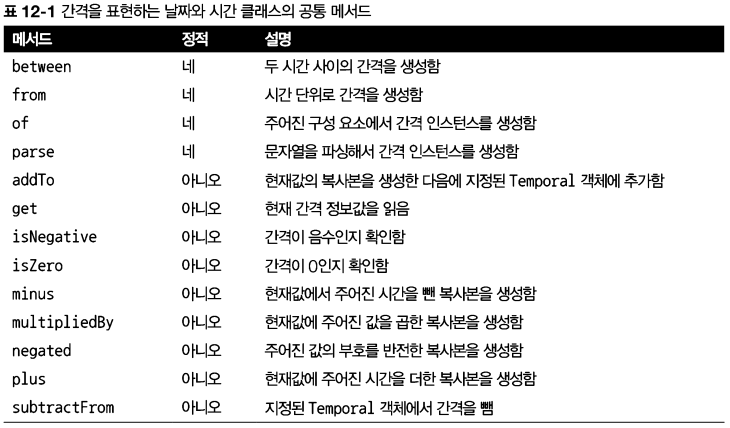
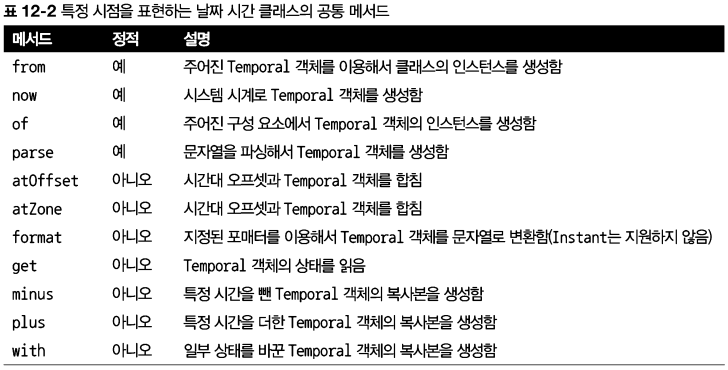
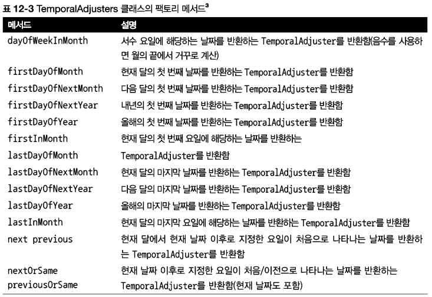

# [Chapter 12](https://livebook.manning.com/book/modern-java-in-action/chapter-12/)

# 새로운 날짜와 시간 API

## 이 장의 내용

- 자바 8에서 새로운 날짜와 시간 라이브러리를 제공하는 이유
- 사람이나 기계가 이해할 수 있는 날짜와 시간 표현 방법
- 시간의 양 정의하기
- 날짜 조작 포매팅, 파싱
- 시간대와 캘린더 다루기

- 자바 1.0 : `java.util.Date`
    - Date 클래스는 특정 시점을 날짜가 아닌 밀리초 단위로 표현한다. 게다가 1900년을 기준으로 하는 오프셋, 0에서 시작하는 달 인덱스 등 모호한 설계로 유용성이
      떨어졌다.
- 자바 1.1 : `java.util.Calendar`
    - 1900년도에서 시작하는 오프셋은 없앴지만 여전히 달의 인덱스는 0부터 시작했다.
    - `Date`와 `Calendar` 두 가지 클래스가 등장하면서 개발자들에게 혼란이 가중
    - `DateFormat`은 스레드에 안전하지 않다. 즉, 두 스레드가 동시가 하나의 포매터 formatter로 날짜를 파싱할 때 예기치 못한 결과가 일어날 수 있다.
- `Date`와 `Calendar`는 모두 가변mutable 클래스
    - 유지보수가 아주 어려워짐
- 자바 8 : Joda-Time 서드파티 라이브러리의 많은 기능을 `java.time` 패키지로추가

## 12.1 Local Date, LocalTime, Instant, Duration, Period 클래스

- `Temporal` 인터페이스를 구현한 클래스들임
- `Temporal` 인터페이스는 특정 시간을 모델링하는 객체의 값을 어떻게 읽고 조작할지 정의함

### 12.1.1 Local Date와 LocalTime 사용

- 정적 팩토리 메서드 `of` 사용
- 팩토리 메서드 `now`는 시스템 시계의 정보를 이용해서 현재 날짜 정보를 얻는다.

### 12.1.2 날짜와 시간 조합

### 12.1.3 Instant 클래스: 기계의 날짜와 시간

- 사람과는 다르게 기계의 관점에서는 연속된 시간에서 특정 지점을 하나의 큰 수로 표현하는 것이 가장 자연스러운 시간 표현 방법이다. 새로운 `java.time.Instant`
  클래스에서는 이와 같은 기계적인 관점에서 시간을 표현한다. 즉, Instant 클래스는 유닉스 에포크 시간Unix epoch time(1970년 1월 1일 0시 0분 0초
  UTC)을 기준으로 특정 지점까지의 시간을 초로 표현한다.

### 12.1.4 Duration과 Period 정의

- 

## 12.2 날짜 조정, 파싱, 포매팅

- 함수형 갱신
    - 이런 `with` 메서드는 기존의 Temporal 객체를 바꾸는 것이 아니라 필드를 갱신한 복사본을 만든다
- 

### 12.2.1 TemporalAdjusters 사용하기

- 
- https://docs.oracle.com/javase/8/docs/api/java/time/temporal/TemporalAdjusters.html
- ofDateAdjuster(UnaryOperator<LocalDate> dateBasedAdjuster)
    - 동일한 반환형 타입
    - 함수형 갱신

### 12.2.2 날짜와 시간 객체 출력과 파싱

- `java.time.format`
- `DateTimeFormatter`
- 정적 팩토리 메서드와 상수를 이용해서 손쉽게 포매터를 만들 수 있다.
- `DateTimeFormatter` 클래스는 `BASIC_ISO_DATE`와 `ISO_LOCAL_DATE` 등의 상수를 미리 정의
- 날짜나 시간을 특정 형식의 문자열로 만들 수 있다

## 12.3 다양한 시간대와 캘린더 활용 방법

- 시간대를 간단하게 처리할 수 있다
- `java.util.TimeZone`를 대체하는 `java.time.Zoneld`
- 서머타임(Daylight Saving Time(DST)) 같은 복잡한 사항이 자동으로 처리된다
- 불변 클래스

### 12.3.1 시간대사용하기

- 지역 ID는 '{지역}/{도시}' 형식
    - https://www.iana.org/time-zones 참고

- 

### 12.3.2 UTC/Greenwich 기준의 고정 오프셋

- UTC(Universal Time Coordinated, 협정 세계시) /GMT(Greenwich Mean Time, 그리니치 표준시) 를 기준 으로 시간대를 표현
- `ZoneOffset` 으로는 서머타임을 제대로 처리할 수 없으므로 권장하지 않는 방식

### 12.3.3 대안 캘린더 시스템 사용하기

- ISO-8601 캘린더 시스템은 실질적으로 전 세계에서 통용된다.
- 자바 8에서는 추가로 4 개의 캘린더 시스템을 제공
    1. `ThaiBuddhistDate`
    2. `MinguoDate`
    3. `JapaneseDate`
    4. `HijrahDate`
- 위 4개의 클래스와 `LocalDate` 클래스는 `ChronoLocalDate` 인터페이스를 구현
    - 임의의 연대기에서 특정 날짜를 표현할 수 있는 기능을 제공하는 인터페이스
- `Chronology`
    - 캘린더 시스템

- 날짜와 시간 API의 설계자는 `ChronoLocalDate`보다는 `LocalDate`를 사용하라고 권고한다. 예를 들어 개발자는 1 년은 12개월로 이루어져 있으며 1 달은
  31 일 이하 이거나, 최소한 1 년은 정해진 수의 달로 이루어졌을 것이라고 가정할 수 있다. 하지만 이와 같은 가정은 특히 멀티 캘린더 시스템에서는 적용되지 않는다. 따라서
  프로그램의 입출력을 지역화하는 상황을 제외하고는 모든 데이터 저장, 조작, 비즈니스 규칙 해석 등의 작업에서 `LocalDate`를 사용해야 한다.

- HijrahDate(이슬람력)
    - 가장 복잡
    - 변형(variant) 의 존재
        - 태음월(lunar month)에 기초
        - 새로운 달(month)을 결정할 때 새로운 달(month)을 전 세계 어디에서나 볼 수 있는지 아니면 사우디아라비아에서 처음으로 새로운 달을 볼 수 있는지 등의
          변형 방법을 결정하는 메서드를 제공

## 12.4 마치며

- 자바 8 이전 버전에서 제공하는 기존의 `java.util.Date` 클래스와 관련 클래스에서는 여러 불일치점들과 가변성, 어설픈 오프셋, 기본값, 잘못된 이름 결정 등의 설계
  결함이 존재했다.
- 새로운 날짜와 시간 API에서 날짜와 시간 객체는 모두 불변이다.
- 새로운 API는 각각 사람과 기계가 편리하게 날짜와 시간 정보를 관리할 수 있도록 두 가지 표현 방식을 제공한다.
- 날짜와 시간 객체를 절대적인 방법과 상대적인 방법으로 처리할 수 있으며 기존 인스턴스를 변환하지 않도록 처리 결과로 새로운 인스턴스가 생성된다.
- TemporalAdjuster를 이용하면 단순히 값을 바꾸는 것 이상의 복잡한 동작을 수행할 수 있으며 자신만의 커스텀 날짜 변환 기능을 정의할 수 있다.
- 날짜와 시간 객체를 특정 포맷으로 출력하고 파싱하는 포매터를 정의할 수 있다. 패턴을 이용하거나 프로그램으로 포매터를 만들 수 있으며 포매터는 스레드 안정성을 보장한다.
- 특정 지역/장소에 상대적인 시간대 또는 UTC/GMT 기준의 오프셋을 이용해서 시간대를 정의할 수 있으며 이 시간대를 날짜와 시간 객체에 적용해서 지 역화할 수 있다.
- ISO-8601 표준 시스템을 준수하지 않는 캘린더 시스템도 사용할 수 있다.