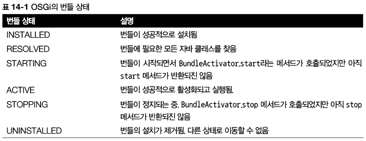
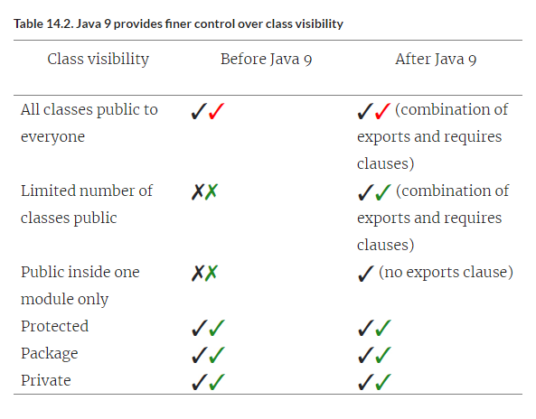

# [Chapter 14](https://livebook.manning.com/book/modern-java-in-action/chapter-14/)

# 자바 모듈 시스템

## 이 장의 내용

- 자바가 진화해야 한다는 여론으로 자바가 모듈 사스템을 지원하기 시작함
- 주요 구조 : 모듈 declarations, requires, exports 지시어
- 기존 자바 아카이브(JAR)에 적용되는 자동모듈
- 모듈화와 JDK 라이브러리
- 모듈과 메이븐 빌드
- 기본적인 requires, exports 외의 모듈 지시어 간단 요약


- 모듈 시스템
    - 자바 9에서 가장 많이 거론
    - 니콜라이 팔로그 Nicolai Parlog 저, The Java Module System(Manning Publications, 2019) 참고

## 14.1 압력 : 소프트웨어 유추

### 14.1.1 관심사분리

- 관심사분리(SoC, Separation of concerns)
    - 컴퓨터 프로그램을 고유의 기능으로 나누는 동작을 권장하는 원칙
    - 클래스를 그룹화한 모듈을 이용해 애플리케이션의 클래스 간의 관계를 시각적으로 보여줄 수 있다
        - 이해하기 쉽고 유지보수하기 간단한 소프트웨어
        - 추론하기 쉬운 소프트웨어
    - 자바 9 모듈은 클래스가 어떤 다른 클래스를 볼 수 있는지를 컴파일 시간에 정교하게 제어할 수 있다
        - 패키지만으로는 모듈성을 지원하지 않는다
- 장점
    - 개별 기능을 따로 작업할 수 있으므로 팀이쉽게 협업할 수 있다.
    - 개별 부분을 재사용하기 쉽다.
    - 전체 시스템을 쉽게 유지보수할 수 있다.

### 14.1.2 정보 은닉

- 정보 은닉(information hiding)
    - 세부 구현을 숨기도록 장려하는 원칙

- 캡슐화
    - 특정 코드 조각이 애플리케이션의 다른 부분과 고립
    - 세부 구현을 숨김으로 프로그램의 어떤 부분을 바꿨을 때 다른 부분까지 영향을 미칠 가능성을 줄일 수 있다

- 자바에서는 클래스 내의 컴포넌트에 적절하게 private 키워드를 사용했는지를 기준으로 컴파일러를 이용해 캡슐화를 확인할 수 있다.
- 하지만 자바 9 이전까지는 클래스와 패키지가 의도된 대로 공개되었는지를 컴파일러로 확인할 수 있는 기능이 없었다.

### 14.1.3 자바 소프트웨어

- 관심사분리(SoC, Separation of concerns)
    - UML 다이어그램
        - 그룹 코드 간의 의존성을 시각적으로 보여줄 수 있음
    - 그림 14-1 세 기능 간의 의존 관계
        - 
- 정보 은닉(information hiding)
    - `public`, `protected`, `private` 등의 접근 제한자와 패키지 수준 접근 권한 등을 이용해 메서드, 필드 클래스의 접근을 제어
        - 원하는 접근 제한을 달성하기 어려우며 심지어 최종 사용자에게 원하지 않는 메서드도 공개해야 하는 상황이 발생
        - 자바 애플리케이션이 커지면서 의존성 체인이 복잡해시면서 문제가 부각되고 있다
        - 설계자는 자신의 클래스에서 개인적으로 사용할 용도라고 생각할 수 있겠지만, 과정이 어쨌든 결과적으로 클래스에 public 필드가 있다면 사용자 입장에서는 당연히
          사용할 수 있다고 생각하지 않겠는가?

## 14.2 자바 모듈 시스템을 설계한 이유

### 14.2.1 모듈화의 한계

- 자바 9 이전까지는 모듈화된 소프트웨어 프로젝트를 만드는 데 한계가 있었음
    - 자바는 세 가지 수준의 코드 그룹화를 제공
        - 클래스
            - 접근 제한자, 캡슐화 제공 O
        - 패키지
            - 접근 제한자, 캡슐화 제공 X
        - JAR
            - 접근 제한자, 캡슐화 제공 X

#### 제한된 가시성 제어

- 패키지의 가시성 제어 기능은 유명무실
    - 한 패키지의 클래스와 인터페이스를 다른 패키지로 공개하려면 `public`으로 이들을 선언해야 한다
        - 💡 why?
        - 
    - 이들 클래스와 인터페이스는 모두에게 공개된다
    - 보통 패키지 내부의 접근자가 `public`이므로 사용자가 이 내부 구현을 마음대로 사용할 수 있다
    - 캡슐화를 하는 데에 한계가 있음

#### 클래스 경로

- 자바 내에서 애플리케이션을 번들(묶음)하고 실행하는 방법
    - 클래스를 모두 컴파일
    - 한 개의 평범한 JAR 파일에 넣고 클래스 경로에 이 JAR 파일을 추가
    - JVM이 동적으로 클래스 경로에 정의된 클래스를 필요할 때 읽는다
- 단점
    - JAR 지옥 또는 클래스 경로 지옥
        - 클래스 경로에는 같은 클래스를 구분하는 버전 개념이 없다
            - 클래스 경로에 두 가지 버전의 같은 라이브러리가 존재할 때 어떤 일이 일어날지 예측할 수 없다
            - 어플리케이션의 크기가 커질 수록 이런 문제가 발생함
        - 클래스 경로는 명시적인 의존성을 지원하지 않는다
            - 각각의 JAR 안에 있는 모든 클래스는 classes라는 한 주머니로 합쳐진다.
            - 즉 한 JAR가 다른 JAR에 포함된 클래스 집합을 사용하라고 명시적으로 의존성을 정의하는 기능을 제공하지 않는다.
            - 이 상황에서는 클래스 경로 때문에 어떤 일이 일어나는지 파악하기 어려우며, 다음과같은 의문이 든다
                - 빠진 게 있는가?
                - 충돌이 있는가?
            - JVM이 `ClassNotFoundException`같은 에러를 발생시키지 않고 애플리케이션을 정상적으로 실행할 때까지 클래스 경로에 클래스 파일을
              더하거나 클래스 경로에서 클래스를 제거해보는 수밖에 없다
- 메이븐이나 그레이들같은 빌드 도구들로 문제점 해결
- 자바 9 모듈 시스템을 이용하면 컴파일 타임에 이런 종류의 에러를 모두 검출할 수 있다.

### 14.2.2 거대한 JDK

- 자바 개발 키트(JDK)
    - 자바 프로그램을 만들고 실행하는 데 도움을 주는 도구의 집합
    - javac, java, 런타임 지원을 제공하는 JDK 라이브러리, 컬렉션, 스트림 등
- 많은 기술이 추가되었다가 사장되기를 반복
    - CORBA를 애플리케이션에 사용하는지와 관계없이 CORBA의 클래스는 JDK에
    - 이는 나중에 모바일에서 실행되는 애플리케이션이나 JDK 전부를 필요로 하지 않는 클라우드에서 문제가 됨
- 컴팩트 프로파일(compact profiles) 기법
    - 관련 분야에 따라 JDK 라이브러리가 세 가지 프로파일로 나뉘어 각각 다른 메모리 풋프린트를 제공
        - 임시 방편
- JDK 라이브러리의 많은 내부 API는 공개되지 않아야 한다.
    - 안타깝게도 자바 언어의 낮은 캡슐화 지원 때문에 내부 API가 외부에 공개되었다.
    - 예를 들어 스프링spring, 네티Netty, 모키토Mockito 등 여러 라이브러리에서 `sun.misc.Unsafe`리는 클래스를 사용했는데 이 클래스는 JDK
      내부에서만 사용하도록 만든 클래스다.
    - 결과적으로 호환성을 깨지않고는 관련 API를 바꾸기가 아주 어려운 상황이 되었다.
- JDK 자체도 모듈화할 수 있는 자바 모듈 시스템 설계의 필요성
    - JDK에서 필요한 부분만 골라 사용하고, 클래스 경로를 쉽게 유추할 수 있으며, 플랫폼을 진화시킬 수 있는 강력한 캡슐화를 제공할 새로운 건축 구조

### 14.2.3 OSGi와 비교

- OSGi를 들어본 적이 없는 독자는 이 절을 스킵해도 된다
- OSGi(Open Service Gateway initiative)
- 
- 프레임워크 내에 같은 번들의 다른 버전을 설치할 수 있다는 것도 OSGi 만의 흥미로운 기능이다.
- OSGi의 각 번들이 자체적인 클래스 로더를 갖는 반면, 자바 9 모듈 시스템의 직소는 애플리케이션당 한 개의 클래스를 사용하므로 버전 제어를 지원하지 않는다.

## 14.3 자바 모듈 : 큰 그림

- 모듈
    - 새로운 자바 프로그램 구조 단위
    - 자바 9 부터 제공
    - `module`이라는 새 키워드에 이름과 바디를 추가해서 정의
    - 모듈 디스크립터(module descriptor)는 `module-info.java`라는 특별한 파일에 저장
    - 
    - 직소 퍼즐（직소 프로젝트도 이 퍼즐에서 이름이 유래했을 것으로 추정）에 비유
        - exports는 돌출부
        - requires는 패인 부분
    - 
        - 그림 14-3 A, B, C, D 네 개의 모듈로 만든 자바 시스템의 직소 퍼즐 형식 예제.
        - 모듈 A는 모듈 B와 C를 필요로 하며 이들은 패키지 모듈 B와 모듈 C를 이용해 각각 pkgB와 pkgC에 접근할 수 있다.
        - 모듈 C는 비슷한 방법으로 pkgD를 사용하는데 pkgD는 모듈 C에서 필요로 하지만 모듈 B에서는 pkgD를 사용할 수 없다.
- 메이븐 같은 도구를 사용할 때 모듈의 많은 세부 사항을 IDE가 처리하며 사용자에게는 잘 드러나지 않는다.

## 14.4 자바 모듈 시스템으로 애플리케이션 개발하기

- 자바 9 모듈 시스템 전반
    - 작은 모듈화 애플리케이션을 구조화하고, 패키지하고, 실행

### 14.4.1 애플리케이션셋업

- 모듈화
    - 여러 기능(관심사)
        - 다양한소스에서 데이터를 읽음(Reader, HttpReader, FileReader)
        - 다양한 포맷으로 구성된 데이터를 파싱(Parser, JSONParser, ExpenseJSON-Parser)
        - 도메인객체를구체화 (Expense)
        - 통계를 계스히고 반환 (SummaryCalculator, SummaryStatistics)
        - 다양한 기능을 분리 조정 (ExpensesApplication)
    - 기능을 그룹화
        - `expenses.readers`
        - `expenses.readers.http`
        - `expenses.readers.file`
        - `expenses.parsers`
        - `expenses.parsersj son`
        - `expenses.model`
        - `expenses.statistics`
        - `expenses.application`

- 실생활에서 단순한 프로젝트를 이처럼 잘게 분해해 작은 기능까지 캡슐화한다면 장점에 비해 초기 비용이 높아지고, 이것이 과연 옳은 결정인가 논란이 생길 수 있다.
- **하지만 프로젝트가 점점 커지면서 많은 내부 구현이 추가되면 이때부터 캡슐화와 추론의 장점이 두드러진다.**
- 위 목록을 애플리케이션 경계에 의존하는 패키지 목록으로 생각할 수 있다.
    - 아마 각 모듈은 다른 모듈로 노출하고 싶지 않은 내부 구현을 포함할 것
        - 예를 들어 expenses, statistics 모듈은 실험적인 통계 방법을 다른 방법으로 구현한 여러 패키지를 포함할 수 있다.
        - 이들 패키지에서 어떤 것을 사용자에게 릴리스할지는 나중에 결정할 수 있다

### 14.4.2 세부적인 모듈화와 거친 모듈화

모듈 크기에 따른 기법차이

- 세부적인 모듈화 기법
    - 모든 패키지가 자신의 모듈을 갖는다
    - 이득에 비해 설계 비용이 증가
- 거친 모듈화 기법
    - 대부분은 한 모듈이 시스템의 모든 패키지를 포함
    - 모듈화의 모든 장점을 잃는다

- 모듈크기를 조율해라
    - 가장 좋은 방법은 시스템을 실용적으로 분해하면서 진화하는 소프트웨어 프로젝트가 이해하기 쉽고 고치기 쉬운 수준으로 적절하게 모듈화되어 있는지 주기적으로 확인하는
      프로세스를 갖는 것이다.

> 모듈화는 소프트웨어 부식의 적이다.

### 14.4.3 자바 모듈 시스템 기초

- 메인 애플리케이션을 지원하는 한 개의 모듈만 갖는 기본적인 모듈화 애플리케이션
    ```
    |─ expenses.application
      |─ module-info.java
      |─ com
        |─ example
          |─ expenses
            |─ application
              |─ ExpensesApplication.java
    ```
- `module-info.java`
    - 모듈 디스크립터로 모듈의 소스 코드 파일 루트에 위치
    - 모듈의 의존성 그리고 어떤 기능을 외부로 노출할지를 정의
        - 이 예제에서는 그 기능을 안쓰므로 빈 파일
- 모듈화 애플리케이션 실행
    - 명령 실행
      ```
      javac module-info.java
           com/example/expenses/application/ExpensesApplication.java -d target
      
      jar cvfe expenses-application.jar
           com.example.expenses.application.ExpensesApplication -C target
      ```
    - 어떤 폴더와 클래스 파일이 생성된 JAR(expenses-application.jar)에 포함되어 있는지를 보여주는 다음과 같은 결과가 출력
      ```
      added manifest
      added module-info: module-info.class
      adding: com/(in = 0) (out= 0)(stored 0%)
      adding: com/example/(in = 0) (out= 0)(stored 0%)
      adding: com/example/expenses/(in = 0) (out= 0)(stored 0%)
      adding: com/example/expenses/application/(in = 0) (out= 0)(stored 0%)
      adding: com/example/expenses/application/ExpensesApplication.class(in = 456)
           (out= 306)(deflated 32%)
      ```
    - 마지막으로 생성된 JAR를 모듈화 애플리케이션으로 실행한다.
      ```
      java --module-path expenses-application.jar \
           --module expenses/com.example.expenses.application.ExpensesApplication
      ```
- java 프로그램으로 자바 .class 파일을 실행할 때 다음과 같은 두 가지 옵션이 새로 추가되었다.
    1. -module-path : 어떤 모듈을 로드할 수 있는지 지정한다. 이 옵션은 클래스 파일을 지정하는 --classpath 인수와는 다르다.
    2. -module : 이 옵션은 실행할 메인 모듈과 클래스를 지정한다.
- 자바 9 모듈 시스템에서 버전 선택 문제를 크게 고려하지 않았고 따라서 버전 기능은 지원하지 않는다.
    - 모듈 정의는 버전 문자열을 포함하지 않는다.
    - 대신 버전 문제는 빌드 도구나 컨테이너 애플리케이션에서 해결해야 할 문제로 넘겼다.

## 14.5 여러 모듈 활용하기

- `expense.reader`라는 새 모듈을 만들 것이다.
- `expenses.application`와 `expenses`, `readers`두 모듈간의 상호 작용은 자바 9에서 지정한 `export`, `requires`를 이용해
  이루어진다

### 14.5.1 exports 구문

```java
module expenses.readers {

    exports com.example.expenses.readers;
    exports com.example.expenses.readers.file;
    exports com.example.expenses.readers.http;
}
```

- `exports`는 다른 모듈에서 사용할 수 있도록 특정 패키지를 공개 형식으로 만든다.
- 기본적으로 모듈 내의 모든 것은 캡슐화
- 모듈 시스템은 화이트 리스트 기법을 이용해 강력한 캡슐화를 제공
    - 다른 모듈에서 사용할 수 있는 기능이 무엇인지 명시적으로 결정해야 한다
    - 이 접근법은 실수로 어떤 기능을 외부로 노출함으로 몇 년이 지난 뒤에 해커가 시스템을 남용할 여지를 방지한다

```
|─ expenses.application
  |─ module-info.java
  |─ com
    |─ example
      |─ expenses
        |─ application
          |─ ExpensesApplication.java

|─ expenses.readers
  |─ module-info.java
  |─ com
    |─ example
      |─ expenses
        |─ readers
          |─ Reader.java
        |─ file
          |─ FileReader.java
        |─ http
          |─ HttpReader.java
```

### 14.5.2 requires 구분

```java
module expenses.readers {
    // 패키지명이 아니라 모듈명이다
    requires java.base;

    // 모듈명이 아니라 패키지명이다
    exports com.example.expenses.readers;
    exports com.example.expenses.readers.file;
    exports com.example.expenses.readers.http;
}
```

- `requires`는 의존하고 있는 모듈을 지정
    - 기본적으로 모든 모듈은 `java.base`라는 플랫폼 모듈에 의존
    - `net`, `io`, `util` 등의 자바 메인 패키지를 포함한다.
    - 항상 기본적으로 필요한 모듈이므로 `java.base`는 명시적으로 정의할 필요가 없다

#### 자바 9는 클래스 가시성을 더 잘 제어할 수 있는 기능을 제공

- 자바 9에서는 `requires`와 `exports` 구문을 이용해 좀 더 정교하게 클래스 접근을 제어할 수 있다.
- 

### 14.5.3 이름 정하기

모듈의 이름 규칙

- 오라클은 패키지명처럼 인터넷 도메인명을 역순(예를 들어 `com.iteratrlearning.training`)으로 모듈의 이름을 정하도록 권고
- 모듈명은 노출된 주요 API 패키지와 이름이같아야 한다는 규칙
- 모듈명은 작성자의 인터넷 도메인 명을 역순으로 시작해야 한다
    - 모듈이 패키지를 포함하지 않거나 어떤 다른 이유로 노출된 패키지 중 하나와 이름이 일치하지 않는 상황을 제외하면

## 14.6 컴파일과 패키징

메이븐, 그레이들 등의 빌드 도구를 이용해 프로젝트를 컴파일할 수 있다

- 각 모듈에 pom.xml을 추가
    - 각 모듈은 독립적으로 컴파일되므로 자체적으로 각각이 한 개의 프로젝트이다
      ```
      |─ pom.xml
      |─ expenses.application
        |─ pom.xml
        |─ src
          |─ main
            |─ java
              |─ module-info.java
              |─ com
                |─ example
                  |─ expenses
                    |─ application
                      |─ ExpensesApplication.java
      |─ expenses.readers
        |─ pom.xml
        |─ src
          |─ main
            |─ java
              |─ module-info.java
              |─ com
                |─ example
                  |─ expenses
                    |─ readers
                      |─ Reader.java
                    |─ file
                      |─ FileReader.java
                    |─ http
                      |─ HttpReader.java
      ```
- 세 개의 pom.xml 파일을 추가해 메이븐 디렉터리 프로젝트 구조를 완성
- 올바른 모듈 소스 경로를 이용하도록 메이븐이 javac를 설정한다.
- `expenses.readers` 프로젝트의 `pom.xml`
    ```
    <?xml version="1.0" encoding="UTF-8"?>
    <project xmlns="http://maven.apache.org/POM/4.0.0"
             xmlns:xsi="http://www.w3.org/2001/XMLSchema-instance"
             xsi:schemaLocation="http://maven.apache.org/POM/4.0.0
         http://maven.apache.org/xsd/maven-4.0.0.xsd">
        <modelVersion>4.0.0</modelVersion>
    
        <groupId>com.example</groupId>
        <artifactId>expenses.readers</artifactId>
        <version>1.0</version>
        <packaging>jar</packaging>
        <parent>
            <groupId>com.example</groupId>
            <artifactId>expenses</artifactId>
            <version>1.0</version>
        </parent>
    </project>
    ```
    - pom.xml에 부모를 정의
        - 부모는 ID `expenses`를 포함하는 부산물(artifact)이다
- `expenses.application` 모듈의 `pom.xml`
    ```
    <?xml version="1.0" encoding="UTF-8"?>
    <project xmlns="http://maven.apache.org/POM/4.0.0"
             xmlns:xsi="http://www.w3.org/2001/XMLSchema-instance"
             xsi:schemaLocation="http://maven.apache.org/POM/4.0.0
         http://maven.apache.org/xsd/maven-4.0.0.xsd">
        <modelVersion>4.0.0</modelVersion>
    
        <groupId>com.example</groupId>
        <artifactId>expenses.application</artifactId>
        <version>1.0</version>
        <packaging>jar</packaging>
    
        <parent>
            <groupId>com.example</groupId>
            <artifactId>expenses</artifactId>
            <version>1.0</version>
        </parent>
    
        <dependencies>
            <dependency>
                    <groupId>com.example</groupId>
                    <artifactId>expenses.readers</artifactId>
                    <version>1.0</version>
            </dependency>
        </dependencies>
    
    </project>
    ```
    - `expenses.readers`를 의존성으로 추가
- 빌드 과정을 가이드할 전역 pom.xml을 설정
    ```
    <?xml version="1.0" encoding="UTF-8"?>
    <project xmlns="http://maven.apache.org/POM/4.0.0"
             xmlns:xsi="http://www.w3.org/2001/XMLSchema-instance"
             xsi:schemaLocation="http://maven.apache.org/POM/4.0.0
         http://maven.apache.org/xsd/maven-4.0.0.xsd">
        <modelVersion>4.0.0</modelVersion>
    
        <groupId>com.example</groupId>
        <artifactId>expenses</artifactId>
        <packaging>pom</packaging>
        <version>1.0</version>
    
        <modules>
        <module>expenses.application</module>
            <module>expenses.readers</module>
        </modules>
    
        <build>
            <pluginManagement>
                <plugins>
                <plugin>
                        <groupId>org.apache.maven.plugins</groupId>
                    <artifactId>maven-compiler-plugin</artifactId>
                        <version>3.7.0</version>
                    <configuration>
                            <source>9</source>
                            <target>9</target>
                    </configuration>
                </plugin>
                </plugins>
            </pluginManagement>
        </build>
    </project>
    ```
    - 두 개의 자식 모듈 `expenses.application`와 `expenses.readers`를 참조하도록 완성한 pom.xml
- JAR 생성

```
./expenses.application/target/expenses.application-1.0.jar
./expenses.readers/target/expenses.readers-1.0.jar
```

- 모듈 애플리케이션을 실행

```
java --module-path \
 ./expenses.application/target/expenses.application-1.0.jar:\
 ./expenses.readers/target/expenses.readers-1.0.jar \
    --module \
 expenses.application/com.example.expenses.application.ExpensesApplication
```

## 14.7 자동 모듈

- 메이븐 컴파일러 플러그인은 빌드과정
    - module-info.java를 포함하는 프로젝트를 빌드할 때 모든 의존성 모듈을 경로에 놓아 적절한 JAR를 내려받고 이들이 프로젝트에 인식되도록 한다.
- `HttpReader`를 저수준으로 구현하지 않고 아파치 프로젝트의 httpclient 같은 특화 라이브러리를 사용해 구현한다고 가정
- expenses.readers 프로젝트의 module-info.java에 이 구문을 추가한 후. mvn clean package를 실행해도 에러가 발생함
    - ```[ERROR] module not found: httpclient```
- 의존성을 기술하도록 pom.xml도 갱신해야 함
    ```
    <dependencies>
        <dependency>
            <groupId>org.apache.httpcomponents</groupId>
            <artifactId>httpclient</artifactId>
            <version>4.5.3</version>
        </dependency>
    </dependencies>
    ```
- httpclient는 자바 모듈로 사용하려는 외부 라이브러리인데 모듈화가 되어 있지 않은 라이브러리다.
    - 자바는 JAR를 자동 모듈이라는 형태로 적절하게 변환한다.
        - 모듈 경로상에 있으나 module-info 파일을 가지지 않은 모든 JAR는 자동 모듈이 된다.
        - 자동 모듈은 암묵적으로 자신의 모든 패키지를 노출시킨다.
        - 자동 모듈의 이름은 JAR 이름을 이용해 정해진다.
        - jar 도구의 --describe-module 인수를 이용해 자동으로 정해지는 이름을 바꿀 수 있다.
      ```
      jar --file=./expenses.readers/target/dependency/httpclient-4.5.3.jar \
          --describe-module
      httpclient@4.5.3 automatic
      ```
        - 그러면 httpclient라는 이름으로 정의된다
- httpclient JAR를 모듈 경로에 추가한 다음 애플리케이션을 실행
    ```
    java --module-path \
     ./expenses.application/target/expenses.application-1.0.jar:\
     ./expenses.readers/target/expenses.readers-1.0.jar \
     ./expenses.readers/target/dependency/httpclient-4.5.3.jar \
       --module \
     expenses.application/com.example.expenses.application.ExpensesApplication
    ```

> 메이븐에는 자바 9 모듈 시스템을 더 잘 지원하는 프로젝트(https://github.com/moditect/moditect)가 있다.
> 이 프로젝트는 module-info 파일을 자동으로 생성한다.

## 14.8 모듈 정의와 구문들

- 모듈 정의 언어에서 사용할 수 있는 몇 가지 키워드

### 14.8.1 requires

- `requires` 구문은 컴파일 타임과 런타임에 한 모듈이 다른 모듈에 의존함을 정의
    ```java
    module com.iteratrlearning.application {
        requires com.iteratrlearning.ui;
    }
    ```
- `com.iteratrlearning.application`은 `com.iteratrlearning.ui`모듈에 의존한다
- `com.iteratrlearning.ui`에서 외부로 노출한 공개 형식을 `com.iteratrlearning.application`에서 사용할 수 있다.

### 14.8.2 exports

- `exports` 구문은 지정한 패키지를 다른 모듈에서 이용할 수 있도록 공개 형식으로 만든다
- 아무 패키지도 공개하지 않는 것이 기본 설정
- 어떤 패키지를 공개할 것인지를 명시적으로 지정함으로 캡슐화를 높일 수 있다
    ```java
    module com.iteratrlearning.ui {
        // 모듈명이 인수
        requires com.iteratrlearning.core;
        // 패키지명이 인수
        exports com.iteratrlearning.ui.panels;
        exports com.iteratrlearning.ui.widgets;
    }
    ```
- `com.iteratrlearning.ui.panels`, `com.iteratrlearning.ui.widgets` 공개

### 14.8.3 requires transitive

- 다른 모듈이 제공하는 공개 형식을 한 모듈에서 사용할 수 있다고 지정
    ```java
    module com.iteratrlearning.ui {
        requires transitive com.iteratrlearning.core;
    
        exports com.iteratrlearning.ui.panels;
        exports com.iteratrlearning.ui.widgets;
    }
    
    module com.iteratrlearning.application {
        requires com.iteratrlearning.ui;
    }
    ```
- `com.iteratrlearning.application` 모듈은 `com.iteratrlearning.core`에서 노출한 공개 형식에 접근할 수 있다
- 필요로 하는 모듈(`com.iteratrlearning.ui`)이 다른 모듈(`com.iteratrlearning.core`)의 형식을 반환하는 상황에서
  전이성(`transitive`)선언을 유용하게 사용할 수 있다.
- `com.iteratrlearning.application` 모듈의 내부에 `com.iteratrlearning.core` 모듈을 다시 선언하는 것은 성가신 일이기 때문
- `com.iteratrlearning.ui` 모듈에 의존하는 모든 모듈은 자동으로 `com.iteratrlearning.core` 모듈을 읽을 수 있게 된다

### 14.8.4 exports to

- `exports to` 구문을 이용해 사용자에게 공개할 기능을 제한함으로 가시성을 좀 더 정교하게 제어
    ```java
    module com.iteratrlearning.ui {
        requires com.iteratrlearning.core;
    
        exports com.iteratrlearning.ui.panels;
        exports com.iteratrlearning.ui.widgets to
         com.iteratrlearning.ui.widgetuser;
    }
    ```
- `com.iteratrlearning.ui.widgets`의 접근 권한을 가진 사용자의 권한을 `com.iteratrlearning.ui.widgetuser`로 제한할 수
  있다.

### 14.8.5 open과 opens

- 모듈 선언에 `open` 한정자를 이용하면 모든 패키지를 다른 모듈에 반사적으로 접근을 허용할 수 있다
    ```java
    open module com.iteratrlearning.ui {
    
    }
    ```
- 반사적인 접근 권한을 주는 것 이외에 open 한정자는 모듈의 가시성에 다른 영향을 미치지 않는다
- 자바 9 이전에는 리플렉션으로 객체의 비공개 상태를 확인할 수 있었다.
    - 진정한 캡슐화는 존재하지 않았다.
    - 하이버네이트Hibenate 같은 객체 관계 매핑(Object-relational mapping,ORM) 도구에서는 이런 기능을 이용해 상태를 직접 고치곤 한다.
    - 자바 9에서는 기본적으로 리플렉션이 이런 기능을 허용하지 않는다.
    - 이제 그런 기능이 필요하면 이전 코드에서 설명한 open 구문을 명시적으로 사용해야 한다.
    - 리플렉션 때문에 전체 모듈을 개방하지 않고도 `opens` 구문을 모듈 선언에 이용해 필요한 개별패키지만 개방할 수 있다.
    - `exports-to`로 노출한 패키지를 사용할 수 있는 모듈을 한정했던 것처럼, `open`에 `to`를 붙여서 반사적인 접근을 특정 모듈에만 허용할 수 있다.

### 14.8.6 uses와 provides

- `provides` 구문으로 서비스 제공자를 `uses` 구문으로 서비스 소비자를 지정할 수 있는 기능을 제공
- 서비스와 `ServiceLoader`
- The Java Module System 참고

## 14.9 더 큰 예제 그리고 더 배울 수 있는 방법

오라클의 자바 문서에서 가져온 다음 예제

```
module com.example.foo {
    requires com.example.foo.http;
    requires java.logging;

    requires transitive com.example.foo.network;

    exports com.example.foo.bar;
    exports com.example.foo.internal to com.example.foo.probe;

    opens com.example.foo.quux;
    opens com.example.foo.internal to com.example.foo.network,
                                      com.example.foo.probe;

    uses com.example.foo.spi.Intf;
    provides com.example.foo.spi.Intf with com.example.foo.Impl;
}
```

- 자바 9로 이전할 때 EE와관련한 여러 패키지가 모듈화된 자바 9 가상 머신에서 기본적으로 로드되지 않는다
- 호환성을 유지하려면 `-add-modules` 명령행을 이용해 명시적으로 필요한 모듈을 추가해야 한다.
- 예를 들어 `java.xml.bind`가 필요하면 `--add-modules java.xml.bind` 를 지정해야 한다.


## 14.10 마치며

- 관심사분리와 정보 은닉은 추론하기 쉬운 소프트웨어를 만드는 중요한 두 가지 원칙이다.
- 자바 9 이전에는 각각의 기능을 담당하는 패키지, 클래스, 인터페이스로 모듈화를 구현했는데 효과적인 캡슐화를 달성하기에는 역부족이었다.
- 클래스 경로 지옥 문제는 애플리케이션의 의존성을 추론하기 더욱 어렵게 만들었다.
- 자바 9 이전의 JDK는 거대했으며 높은 유지 비용과 진화를 방해하는 문제가 존재했다.
- 자바 9에서는 새로운 모듈 시스템을 제공하는데 module-info.java 파일은 모듈의 이름을 지정하며 필요한 의존성(requires)과 공개 API(exports)를
  정의한다.
- requires 구문으로 필요한 다른 모듈을 정의할 수 있다.
- exports 구문으로 특정 패키지를 다른 모듈에서 사용할 수 있는 공개 형식으로 지정할 수 있다.
- 인터넷 도메인명을 역순으로 사용하는 것이 권장 모듈 이름 규칙이다.
- 모듈 경로에 포함된 JAR 중에 module-info 파일을 포함하는 않는 모든 JAR는 자동 모듈이 된다.
- 자동 모듈은 암묵적으로 모든 패키지를 공개한다.
- 메이븐은 자바 9 모듈 시스템으로 구조화된 애플리케이션을 지원한다.